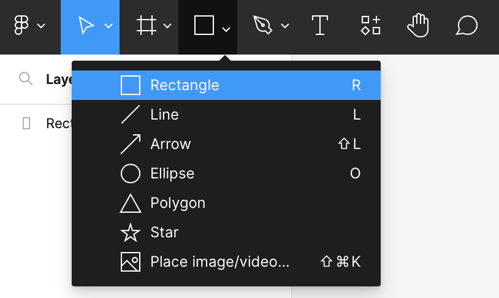
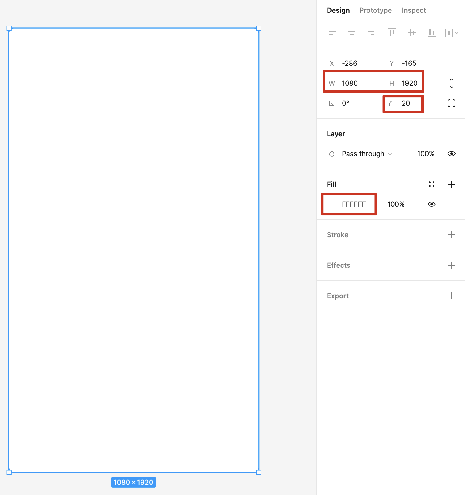
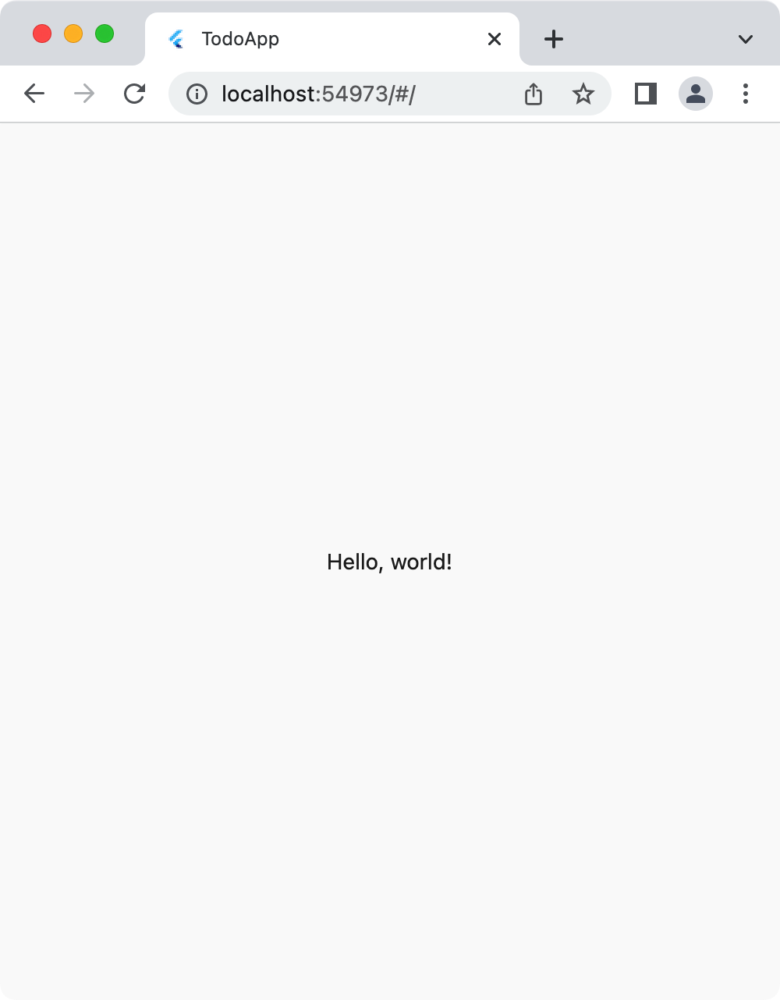

# TodoApp 设计开发全流程

这一节课我们将通过开发一个完整的应用 TodoApp 来快速了解 Flutter 构建应用的全流程。

TodoApp 大家可能也用过，类似备忘录的软件。一般可以把一些要做的事情记录进去，随时可以查看。在应用开发中，这也算是最简单的一种应用了。

## 数据结构设计

在实际动手开发之前，我们需要先想清楚应用中都有哪些数据。

对于一条 `Todo` 而言，用户在输入框中输入待办事项可以创建一条。那么这一条 `Todo` 至少要包含一个 `content`，类型是字符串。在展示多条 `Todo` 的时候，我们需要对它们进行排序，这里比较方便的是使用创建时间进行排序，因此我们还需要添加一个 `createdAt` 的时间戳。因为每一条 `Todo` 都是唯一的，所以我们再添加一个 `UUID`，以后查找某一条 `Todo` 就可以通过 `UUID` 来找。

<!-- TODO 这里最好添加一下 UUID 的定义 -->

但是我们第一节课演示不需要这么复杂，我们只需要 `content` 和 `number` 这两个值就可以了。

在使用 Flutter 构建应用程序的过程中，我们使用的语言是 Dart。这是 Google 创造的一门新语言，说的是对应用开发专门优化过。Dart 是一门面向对象的语言，因为面向对象是很适合 UI 构建的；Dart 也和诸多现代语言一样支持函数编程、协议扩展等多种便捷的操作。

使用 Dart 定义一个 `Todo` 类如下：

```dart
class Todo {
  int number = 0;
  String content = "";

  Todo(int number, String content) {
    this.number = number;
    this.content = content;
  }
}
```

或者使用 initializing formal parameters 简写为：

```dart
class Todo {
  int number = 0;
  String content = "";

  Todo(this.number, this.content);
}

void main(List<String> arguments) {
  Todo a = Todo(0, "完成课堂作业");
  Todo b = Todo(1, "看课件预习");
  print("${a.number} ${a.content}");
  print("${b.number} ${b.content}");
}
// $ dart run
// Building package executable... 
// Built dartlearn:dartlearn.
// 0 完成课堂作业
// 1 看课件预习
```

继续考虑数据结构，要展示多条 `Todo`，还需要一个数组来存放现有的 `Todo`。

```dart
class Todo {
  int number = 0;
  String content = "";

  Todo(this.number, this.content);
}

class TodoList {
  List<Todo> data = [];
  int count = 0;
}
```

- `List<Todo>` 的 `List` 是一种类型，也就是我们常说的数组。这里的 `<Todo>` 是范型，指这一种 `List` 中数据的类型为 `Todo`，也就是我们创建了一个名为 `data` 的 `Todo` 数组。

到这里 TodoApp 的数据已经定义结束了。但是我们还需要定义一些用户操作，比如用户添加一个 `Todo`；一件事情做完了，用户需要完成某件 `Todo`，这时我们考虑直接删除掉这一条 `Todo`。

```dart
class Todo {
  int number = 0;
  String content = "";

  Todo(this.number, this.content);
}

class TodoList {
  List<Todo> data = [];
  int count = 0;

  void insert(String content) {
    data.add(Todo(count, content));
    count += 1;
  }

  void delete(int number) {
    data.removeWhere((todo) {
      return todo.number == number;
    });
  }

  void display() {
    for (final todo in data) {
      print("${todo.number} ${todo.content}");
    }
  }
}

void main(List<String> arguments) {
  TodoList todoList = TodoList();
  todoList.insert("完成课堂作业");
  todoList.insert("看课件预习");
  todoList.display();
  todoList.delete(0);
  todoList.display();
}
// $ dart run
// Building package executable... 
// Built dartlearn:dartlearn.
// 0 完成课堂作业
// 1 看课件预习
// 1 看课件预习
```

- `data.add(...)`: `add()` 方法可以给数组末尾添加一个新值。
- `data.removeWhere((todo) { return todo.number == number; });` 这里 `removeWhere()` 函数的参数是一个函数，这个函数的输入为一个 `Todo`，输出为 `bool` 值；如果 `bool` 值为 `True`，那么这个值就会被移除掉。这里算是函数式编程的思想，往函数中传递一个函数。
- `for (final todo in data) { ... }` 一个标记为 `final` 的变量只能被赋值一次。这里只读取出数组中的数据进行显示。

## UI/UX 设计

数据结构设计完之后我们要考虑如何将这些数据显示到屏幕上，当然最终我们是需要 Flutter 这个框架将其实现，但是在早期阶段，我们需要使用 UI/UX 设计工具先简单画一下我们脑中的想法，这样子之后照着设计稿去写代码效率是更高的。

这里我十分推荐 [Figma](https://www.figma.com/) 这款 UI 设计工具，Figma 简单易上手，网页端的优化做的很好，团队协作功能超强。可以说是从入门到进阶都可以使用使用的一款 UI 设计工具。

打开网站之后注册或者登陆账号，新建一个 Draft 就可以开始画 UI 了。左上角点击长方形的框，我们先把手机的框画出来。随便画一个长方形就行了。



画好之后点击这个矩形，在右侧可以调整宽高、圆角度数、颜色等信息。



接下来我们要考虑怎么把界面元素放上去：

- TodoApp 的数据 `todoList.data` 可以用一个上下滚动的视图显示出来
- 用户需要添加一条 `Todo` 的时候，也就是需要调用 `todoList.insert()` 时，应该有一个文本输入框接收用户输入，然后有一个确认键添加这一条 `Todo`。类似微信下方发送消息的输入框和右侧的发送键。
- 用户完成一条 `Todo` 的时候，也就是需要调用 `todoList.delete()` 时，需要在一条 `Todo` 上进行操作。比如长按出现一个菜单其中包含「完成」按钮。这里我们直接将「完成」按钮放在 `todo.content` 的左侧，用户点击左侧的「完成」按钮之后，这一条 `Todo` 就会消失。

然后继续在 Figma 中画 UI 吧。利用矩形、文字这些基础的组件，调整大小、圆角度数，可以画出一个下方的输入区：


- 用 `cmd / ctrl G` 来让有关系的组件成组，方便后续查看和修改。
- 注意层级遮挡关系，在左侧可以看到当前界面所有的元素，在上方的组件会遮挡下方的组件。

同理，我们画出一个 Todo，然后成组，然后复制出另一个 Todo。这里我们希望有更多的 Todo，于是选中两个现有的 Todo，再次进行复制移动。可是这里间距不一致，我们可以使用 Figma 提供的排版工具，`Tidy up` 一下就整齐了。


完成效果图如下：


## 安装 Flutter 准备开发环境

画好 UI、想好 UX 之后，我们开始用 Flutter 来做 TodoApp。

Flutter 是 Google 推出的一款是声明式 UI 构建框架，其借鉴了前端 React 框架的思想，将用户界面视为 App 中所有状态的映射，也即，用这些状态渲染出当前的界面 UI。下一节课我们会详细讲讲 Flutter 背后的一些原理，这节课我们只要知道 Flutter 一个大致的用法就行了。

安装请查看 [安装 Flutter](./flutter-installation.md) 这篇文章。

安装成功后，你还需要一款编辑器，这里推荐使用 [VS Code](https://code.visualstudio.com)，打开后还需要安装 Dart 和 Flutter 这两款官方的插件。

同时你需要安装模拟器方便在开发的过程中查看应用的效果。请查看：

- [在 Windows 上创建打开 Android 模拟器进行调试](./simulator-windows-android.md)
- [在 macOS 上创建打开 Android 模拟器进行调试](./simulator-macos-android.md)
- [在 macOS 上创建打开 iOS 模拟器进行调试](./simulator-macos-ios.md)

开模拟器对电脑性能有着不小的开销……我这里使用 Chrome 进行调试，查看 [使用 Chrome 进行调试](./simulator-chrome.md)。

有同学会问，我们不是移动应用开发课程吗，为什么会用到 Chrome 呢？这就要说到 Flutter 的跨平台特性了。Flutter 现在支持的发布渠道有 Android、iOS、Windows、macOS、Linux、网页端，能支持全平台的原因是，Flutter 框架做的事情只是在一块 `height*width` 的画布上渲染出 UI。因此我们只要把 Chrome 拉成竖屏的分辨率，其实在开发阶段是会方便一些的。当然最终也需要在模拟器和真机上运行，这样才能确保应用实际可用（比如在电脑端输入就不会从下方弹出键盘占界面）。当然你也可以直接发布成网页版在手机浏览器中打开。

## 创建项目

使用 `flutter create todoapp` 在当前工作目录创建名为 `todoapp` 的 Flutter 项目，用 `code todoapp` 即可在 VS Code 中打开改项目。

打开之后我们最好先用 Git 初始化一下（`.gitignore` 文件在创建项目的时候已经创建了），结合 VS Code 的源代码管理能够看到代码的修改情况。 `git init` `git add` `git commit -m "init"`。

### 项目结构

项目的结构如下：

```
.
├── .dart_tool/
├── .git/
├── .gitignore
├── .idea/
├── .metadata
├── README.md
├── analysis_options.yaml
├── android/
├── ios/
├── lib/
├── linux/
├── macos/
├── pubspec.lock
├── pubspec.yaml
├── test/
├── todoapp.iml
├── web/
└── windows/
```

- `lib/` 中是程序的源代码，也是之后我们添加代码主要的地方。应用从 `lib/main.dart` 的 `main()` 函数开始执行。
- `test/` 中是测试文件，我们可以直接删除 `test/widget_test.dart` 这个文件。
- `android/` `ios/` `windows/` `macos/` `linux/` `web/` 是各个目标平台特有的代码，在需要定制一些目标平台的项目时需要将目标平台的原生代码放到这些目录下，或者打开对应的项目进行修改。
- `pubspec.yaml` 项目配置和依赖管理。
- `analysis_options.yaml` Dart 语言 linter 配置。

### 关于 analysis_options

新建项目之后，在 `analysis_options.yaml` 的 `linter > rules` 下面添加 `prefer_const_*` 以防止 `Dart` 不停提示添加或移除 `const`：

```yaml
linter:
  rules:
    # avoid_print: false  # Uncomment to disable the `avoid_print` rule
    # prefer_single_quotes: true  # Uncomment to enable the `prefer_single_quotes` rule
    prefer_const_constructors: false
    prefer_const_constructors_in_immutables: false
    prefer_const_literals_to_create_immutables: false
```

在学习阶段，我很推荐这么做。否则你会在 VS Code 中看到大片蓝色波浪线，且不断看到下面的提示：`Prefer const with constant constructors.`。甚至按照提示加了 `const` 关键字之后再修改还会直接导致代码出错。

在项目实际需要发布的时候，将这三条新加的 rules 删除或注释掉，添加这些 `const` 关键字使得不会变的 `Widget`s 只被创建一次，提高应用的性能。

### Hello, world!

接下来我们创建一个显示 `Hello, world!` 的应用。我们删除掉 `lib/main.dart` 中的全部内容，替换为下面的内容：

```dart
import 'package:flutter/material.dart';

void main() {
  runApp(MyApp());
}

class MyApp extends StatelessWidget {
  MyApp({super.key});

  @override
  Widget build(BuildContext context) {
    return MaterialApp(
      title: "TodoApp",
      home: Scaffold(body: ContentWidget()),
      debugShowCheckedModeBanner: false,
    );
  }
}

class ContentWidget extends StatelessWidget {
  ContentWidget({super.key});

  @override
  Widget build(BuildContext context) {
    return Center(
      child: Text("Hello, world!"),
    );
  }
}
```

#### 运行

先别管里面写了什么，保存文件，`ctrl J / cmd J` 调出 VS Code 的终端。先输入 `flutter devices` 查看本机连接的设备：

```
Chrome (web) • chrome • web-javascript • Google Chrome
```

我们使用 Chrome 来运行 `Hello, world!` 程序，在终端输入 `flutter run -d chrome --web-renderer html` 回车稍等片刻即可看到运行的应用了。

- `-d` 后面跟的是目标平台，只要输入 `flutter devices` 结果中的前几个字母就行了，可以匹配
- `flutter run -d chrome` 运行得到的程序对 Unicode 的支持很差，这里我们选择另一种构建方式。关于网页应用两种构建方式的区别见 https://docs.flutter.dev/development/platform-integration/web/renderers



- 拖拽 Chrome 边框，可以看到 `Hello, world!` 总是在屏幕中心。
- 修改 `Text("Hello, world!")` 中的字符串为任意内容，在终端按 `r` 或 `R` 即可热更新，Chrome 呈现的应用会更新显示内容。
- 在终端按 `q` 即可结束应用运行，也可以直接点击关闭或者退出结束应用。

#### 代码讲解

- L1
    - `import 'package:flutter/material.dart';` 导入了官方的 `material` 包。Material Design 是 Google 官方制定的一套设计标准，其中各种常用的包含 UI 组件、UX 交互、主题样式等信息。Flutter 支持使用 Material Design，这能够减少我们重复造轮子。
- L3
    - `void main()` 程序从这里开始运行
- L4
    - 鼠标放到 `runApp` 上方，可以看到函数原型是 `void runApp(Widget app)`。在 Flutter 中，所有的界面元素都是一个 `Widget`。这里我们实例化一个 `MyApp()` 传入 `runApp()`。
- L7
    - `extends` 关键字表示继承。`MyApp` 是 `StatelessWidget` 的一个子类。
    - 在 Flutter 中，Widget 都由两种基类继承而来：`StatelessWidget` 和 `StatefulWidget`，无状态 Widget 和有状态 Widget。
- L8
    - 关于 key，可以查看 <https://docs.flutter.dev/development/ui/widgets-intro> 的 Keys 部分。
- L10
    - `@override` 表示下面的函数重写父类的方法
- L11
    - `Widget build(BuildContext context)` 这个函数，也就是 `build()` 函数，是 Flutter 中构建用户界面的关键。可以看到 `build()` 函数的返回值是一个 `Widget`。你可以配合各种参数使用一些基础的组件来构建出一个新的 Widget，然后返回即可。
    - `context` 中有一些 Widget 之间传递的信息，这一节课我们暂时不用考虑。
- L12-L16
    - `MaterialApp` 可以说是一个 Widget。我们传入了三个参数：
        - `title` 应用展示的名称。可能出现在浏览器标签栏，或者在任务管理器。
        - `home` 当前应用的主页，打开应用之后呈现这个界面。
        - `debugShowCheckedModeBanner` 是否显示右上角的开发提示。这里我们关闭。
    - 一般使用 Flutter 构建应用我们都会使用 `MaterialApp` 作为应用的「根」，即使你可能并不使用 Material Design，其中实现了很多大多数都需要的功能，比如主题管理、字体样式管理等。按照需求传递参数进行配置即可，十分方便。
- L14
    - `Scaffold(body: ContentWidget())` 这里 `Scaffold` 可以理解为「一页」，或者说这是对传入 `body` 的界面的一个升级，在这「一页」添加了一些 Material Design 常用的视觉元素和视觉效果。
- L25-L27
    - `Center` 也是一个 `Widget`，可以说，Flutter 中不论是 UI 组件还是布局，通通都是 `Widget`，
    - `child` 参数传入另一个 Widget，也就是需要 `Center` 这个 Widget 居中的 Widget，这样就组成了一个树状结构。结合上面的代码，现在的结构是：MaterialApp > Scaffold > Center > Text。
    - `Text` Widget 的第一个参数是要显示的文字，还有很多参数可以配置。比如我们这里尝试将 `Hello, world!` 调大一些：在 `Text` 的初始化列表中添加 `style: TextStyle(fontSize: 36)`，终端按 `r` 或 `R` 刷新，就可以看到放大后的字体了。

## StatelessWidget 呈现整个 UI

## StatefullWidget 呈现 todoList

## 添加按钮

## 完成按钮

## Provider 状态管理

## SQLite 持久存储

发现问题，退出app之后再打开记录的东西都没了，引出持久存储

## 发布应用

### 安卓 APK

### 网页版


## 可改进的地方

- 给 `Todo` 加上 `createdAt` 的时间戳还有唯一标志 `UUID`。
- 用户添加一条 `Todo` 之后无法修改，这是个比较糟糕的事情。
- 添加动画
    - 添加一条 `Todo` 之后，滑至最下方
    - 删除一条 `Todo` 之后，让 `Todo` 消失的自然一些，比如从上方滑出，从左侧滑出
- 更好的 UI 设计？
    - 用浮动的一个加号表示添加，而不是时刻都在最下方显示输入框。
