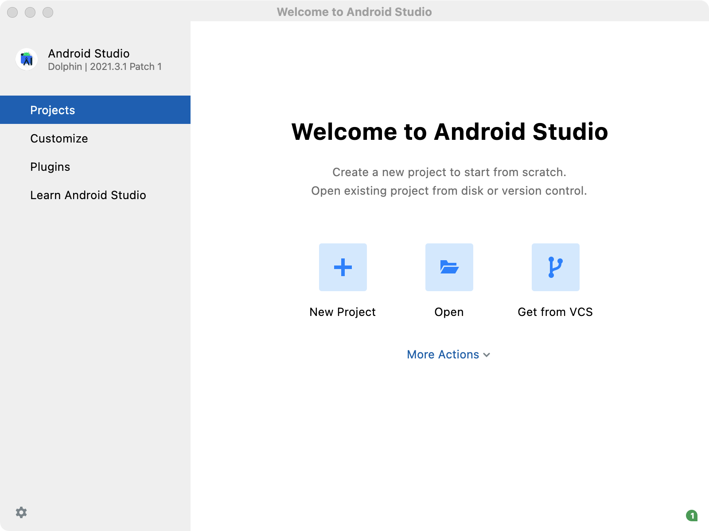
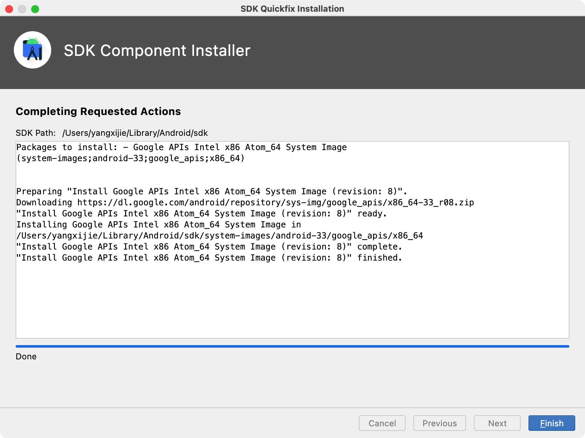
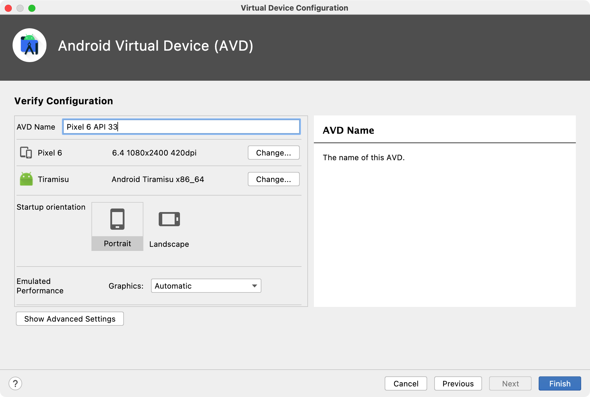
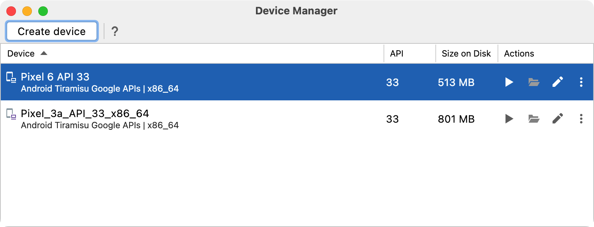
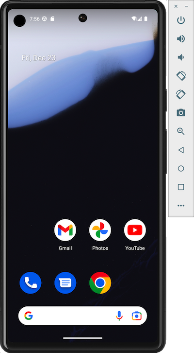

# macOS 创建 Android 模拟器

安装 Android Studio 并打开。

开始界面中间点击 More Actions > Virtual Device Manager。



可以看到这里已经有了一个，点击右侧三角形播放键开始运行。


或者点击左上角 Create device 创建一个新的设备。比如我这里选择 Pixel 6，选择镜像 Tiramisu 进行下载。选择好之后选择 Finish 即可创建。






点击右侧的播放按钮即可打开模拟器：





使用 `flutter devices` 查看虚拟机名称：

```
$ flutter devices
4 connected devices:

sdk gphone64 x86 64 (mobile) ...
iPhone 13 221223 (mobile) ...
macOS (desktop) ...
Chrome (web) ...
```

在工程文件夹中使用下面的命令运行项目：

```
$ flutter run -d sdk
```

## References

- https://docs.flutter.dev/get-started/install/macos#android-setup
