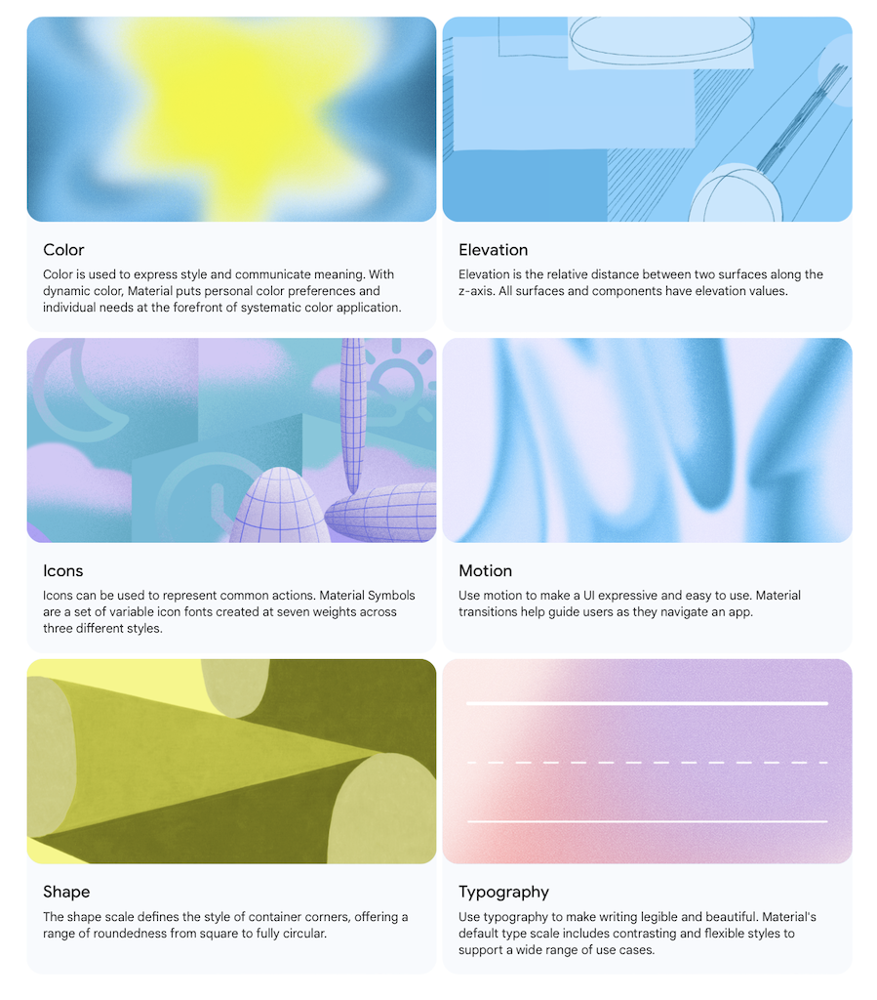
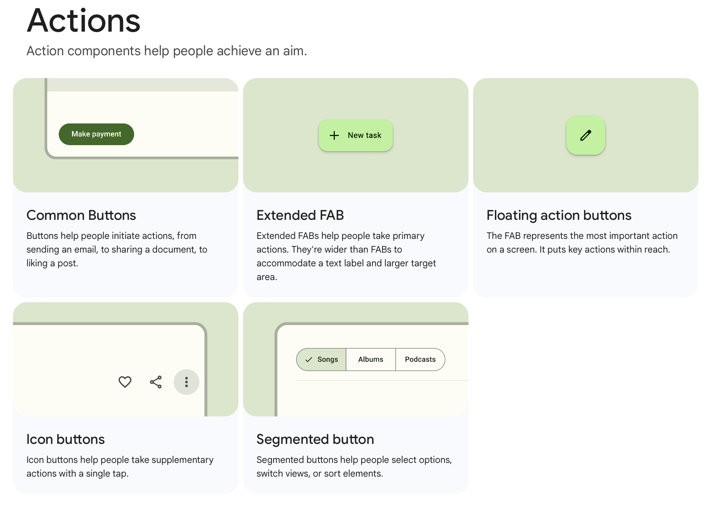
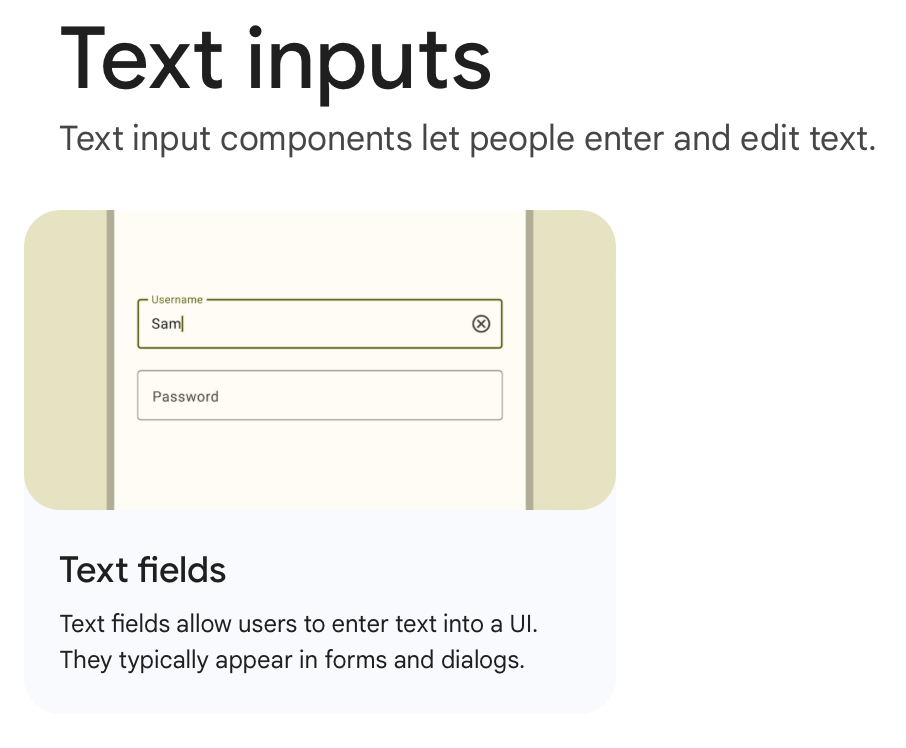
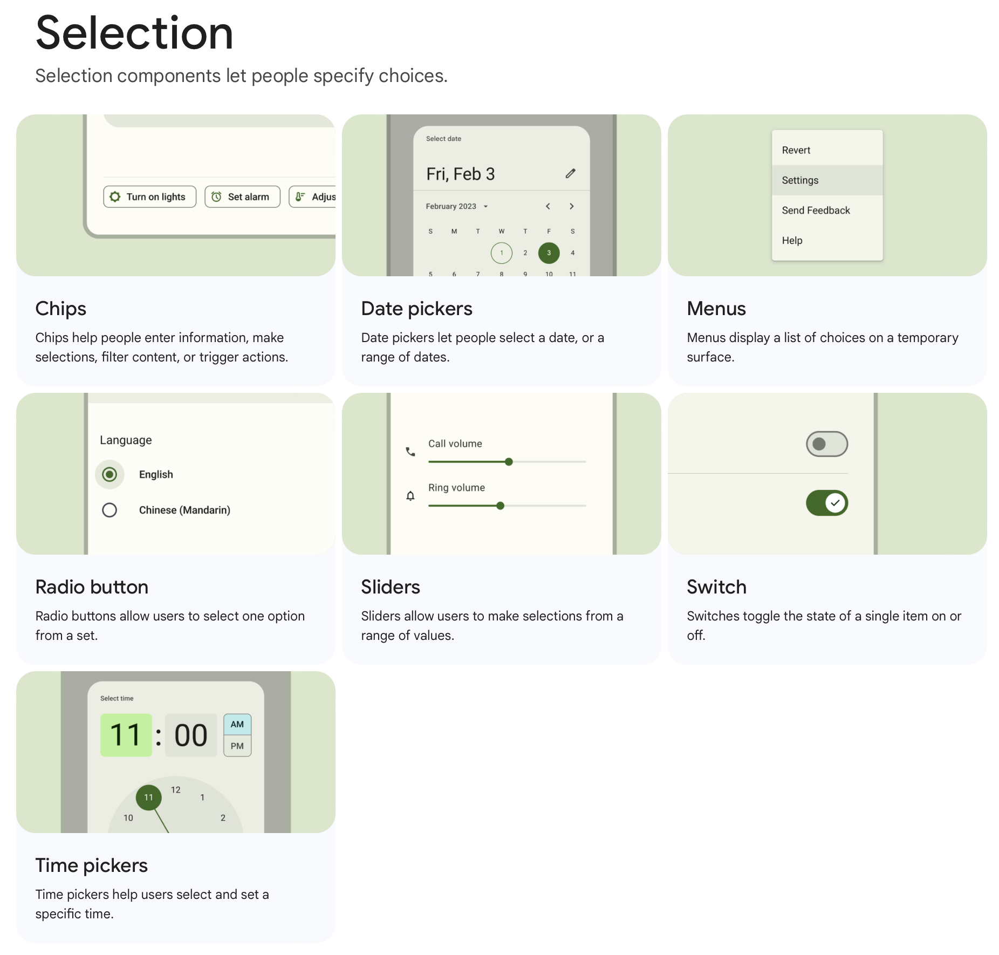
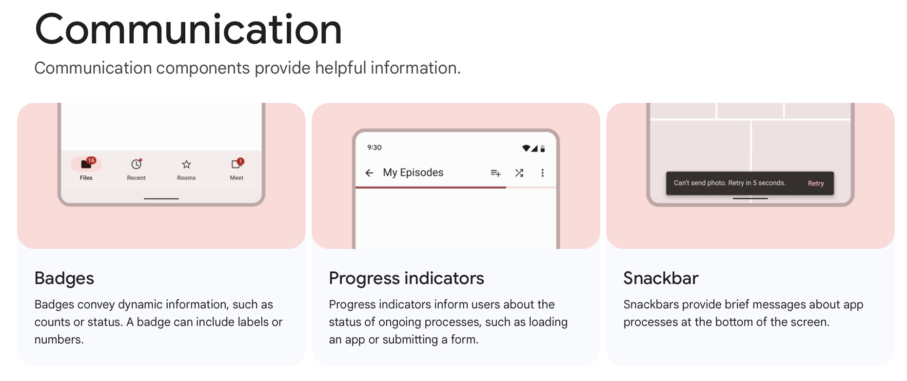
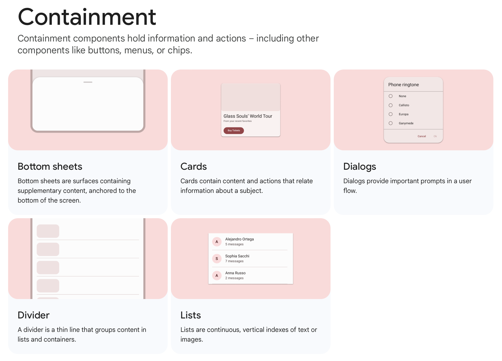
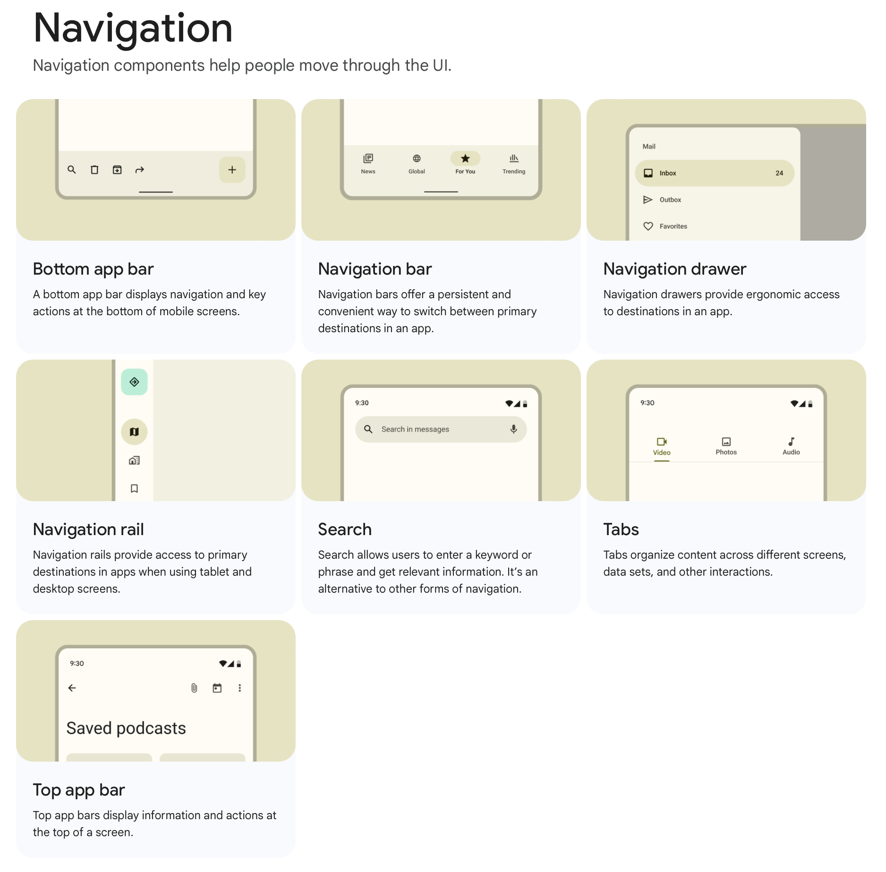
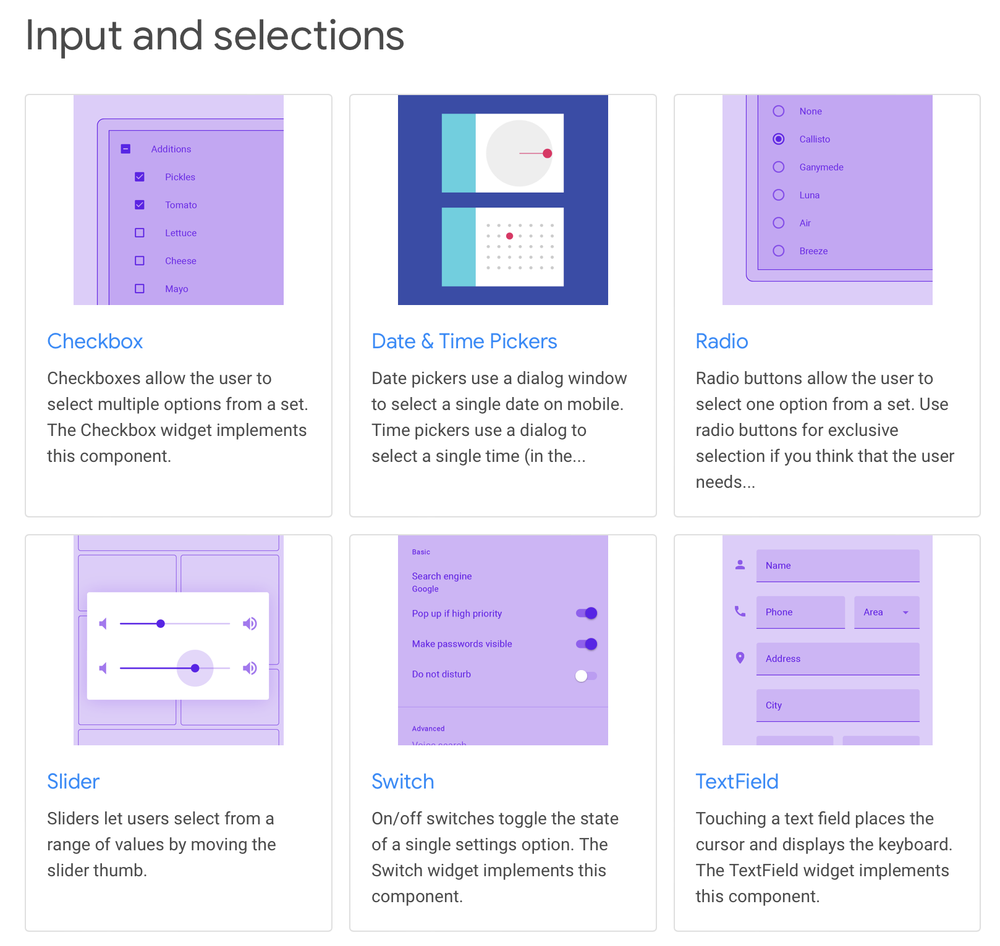

# 设计概览

## 应用开发团队分工

一般一款应用的诞生离不开下面的五个团队：

- 产品经理
    - 在初期分析市场需求、确定应用的目标群体、分析目标群体需求、确定应用的大致方向。
    - 规划应用的功能。
    - 管理项目进度。
- 设计团队
    - 确定应用中的数据结构。
    - 确定 UI（用户界面）和 UX（用户交互）设计稿件。
- 后端开发
    - 根据数据结构搭建应用后端。
- 前端开发
    - 根据 UI/UX 设计稿在目标平台用框架和代码构建应用。
- 运维团队
    - 在应用开发的全周期对代码质量进行管理。
    - 在应用发布之后关注用户反馈，提出应用可能需要更改的地方。

## 应用开发流程

下面所列出的大概是一款应用开发的流程：

### 应用选型

这一步主要是产品经理所做的事情。

#### 发现问题

一般当你想要开发一个软件的时候，你的考虑往往是**解决一个现实的问题**：

- 比如想和朋友实时聊天，然后微信就被开发出了
- 比如想和小伙伴交流问题，然后知乎就有了
- 比如有人觉得 C/C++ 虽然功能齐全，但相对老旧、代码编写起来很困难，于是各种现代编程语言就被设计出来

总之如果你想做有用的应用，你需要做到**问题导向**的——去解决什么问题，目标用户有哪些需求**，脑子里面带着问题去想**解决方案**，然后去设计应用。

很多时候，不要为了开发应用而去开发应用，而是面向问题来思考是否开发某个应用。可以头脑风暴一下自己身边有哪些**问题和机遇**——

- 看看自己生活中有哪些觉得不爽的地方
- 看看自己身边有哪些可以改进的地方
- 现在手机上的应用哪些还不够好用
- 有哪些应用可能在十年内会发光发热

其实你会发现 这不就是写论文的过程（调研）吗？看看别人做了什么，然后找找gap。调研的时候你可以头脑风暴、可以发问卷、可以调研同类的软件、可以看看相关的论文，更可以和相关的人聊一聊。信息收集的多了，你就知道哪些地方还有缺口，哪些地方还可以改进，这个就是gap。

当然**不要重复造轮子**，如果市面上已经有你想要的那种应用了，那就没太大必要重新自己实现一遍了；当然如果市场上的那种应用还不够好、或者说还没有完全抢占市场，那做一款类似的吸引目标用户也是一个选择。

#### 应用形式选择

- 使用方式
    - `命令行`
        - 如果面向的是熟知操作系统相关的用户，也许命令行程序就已经足够了，你可以减少对UI的考虑，多在内部逻辑功能上下功夫。
    - `图形界面`
        - 如果你想创建UI程序，也要注重你的目的：如果只是想给用户提供一个功能的使用接口，那其实做的简单一些也没有什么关系；如果是注重用户交互体验，那你的交互设计、动画、页面逻辑应该要下很大功夫
- 提供服务的方式：`本地计算` or `网络后端服务`
    - 大家可能知道服务即应用（SaaS），我这里想说的是：Linux后端服务为主还是应用在平台上的实现为主。比如你想做一个在线的棉花糖提问箱，网页后端写好，不论是浏览器还是本地应用，调用服务就可以搭建应用了，也许一个浏览器应用就足够了；但是如果你想做游戏，那可能本地构建还是更好一些。有些东西，能通过网络实现的话，其实没必要写平台（对应OS）的代码。如果希望跨平台，各种跨平台的框架也是可以考虑的。

#### 目标平台选择

**设备选择**：`手机`、`平板`、`电脑`（几种设备是很不一样的哦 我在之后会说到这一点）当然你可能要同时支持好几个

**系统选择**：

- `iOS` or `Android`？
- `iPadOS` or `Android`？
- `macOS` or `Windows` or `Linux`？
- 跨平台？浏览器？

一些区别在哪里呢？

- 比如你想开发游戏，有一说一用 Linux 应该会很辛苦，因为 Linux 平台用户较少、可能没有很好的游戏引擎、硬件的支持会弱一些。
- 如果要做商业软件，比如你要做机械设计软件、电路仿真软件，那大概率就选择 Windows 了，因为 Windows 的后向兼容承诺，你几十年不更新应用都没问题；macOS 并不承诺后向兼容就没有这么幸运了，而且苹果平台会不断让你给应用添加一些新的应用信息，总之就是你得不断更新你的应用，不然要么被下架、要么打开闪退。
- 跨平台的话，对于中小型软件来说我觉得是不错的选择，比如使用Flutter、React Native、Qt 这些框架，一份代码全平台部署。这里也有需要权衡的点，跨平台的框架和目标平台是否有着比较好的接口调用方式，是不是选择原生开发更好...

### 设计

对于咱们信息学院的工科同学来说，可能不是很看重应用的设计，但设计前置于开发，是一个应用的核心。

#### 什么是设计

苹果公司为什么成功？是硬件软件的科技嘛？其实更多的是**设计**。很多人都说 苹果算是全球数一数二的设计公司。好的设计让苹果把软硬件结合起来 实现了更人性化的系统。

回到现实中，盖楼、建房子的时候没有图纸怎么盖啊？第一步一定是画图纸。

一样的，没有设计方案，直接去写代码一定是空中楼阁。

**一般来说都是想好了再动手**。开始写完整的项目代码前最好已经有详细的数据结构、UI、UX设计，如果代码已经写的差不多了又开始改需求、改设计、改文档的话，代码是比较难调整的，甚至要重构很多部分。这时有同学就会问了，怎么可能在前期思考的时候面面俱到呢？是的，但至少要想个八九不离十，如果前期设计走了歪路，后面应用开发就很难开发好了。

#### 设计包含什么

不仅仅是界面 UI、交互 UX、还有你的数据结构 Data Structure、代码组织 Project Management，这些都是**设计**。

- 数据结构 Data Structure：应用基本上都是数据驱动的，你需要管理应用中的数据流。比如用表格列出了应用需要所有的数据类型，使用关系型数据库定义数据关系。
- 界面 UI：用户一眼看到的就是你的 UI，好的 UI 很容易给用户带来好的印象。一些显著的 UI 也可以帮助用户找到应用中比较核心的功能。
- 交互 UX：符合直觉的交互、或者简明的交互不至于让用户在你的应用中迷路。
- 代码组织 Project Management：基本上就是几个人如何合作的问题，因为开发应用很难是一个人的事情。在代码细节上，更多是哪些文件要放到哪些文件夹，项目到底有几份可执行文件，Git 使用的规范是怎样的……等等。这些都会影响实际的开发效率。如果组织的好，打开工程看到的就是清楚的思路和逻辑；组织的不好，想修一个 bug 半天都找不见要改的地方在哪里。

设计其实是一个整体规划，如果不知道从哪里下手，可以先看看官方的一些设计文档。下面我们也会讲到 Google 推出的一种设计规则 Material Design 和苹果提出的 Human Interface Guidelines。

#### 设计工具

- 思路
    - 草稿纸和铅笔 or iPad 和 Apple Pencil
    - 文本编辑器 备忘录
    - 在线文档
- 进一步整理思路
    - 思维导图软件：Xmind
    - 在线文档
- 设计文档
    - Markdown、Word 等格式化文本
    - 非常重要 有了设计文档 设计人员和开发人员才能一起合作
    - 包括但不限于 UI UX 数据结构 代码组织
- UI 设计 和 UX 设计
    - Figma
    - Adobe XD
    - Sketch
    - Powerpoint / Keynote

我们在后面主要希望教会大家使用 Figma 这一款 UI 设计工具。

### 开发

可以看到，开发并不是第一步。事实上，在实际的商业应用开发过程中，「开发程序员」所做的事情就是把「设计团队」做好的数据架构在服务器搭建部署、将 UI/UX 稿在对应的平台用代码实现出来。在大厂职务分的比较清楚的时候，「开发程序员」不会过多的参与到设计的部分。

再强调一遍：一般来说都是**想好了再动手**。开始写完整的项目代码前最好已经有详细的数据结构、UI、UX设计，如果代码已经写的差不多了又开始改需求、改设计、改文档的话，代码是比较难调整的，甚至要重构很多部分。这时有同学就会问了，怎么可能在前期思考的时候面面俱到呢？是的，但至少要想个八九不离十，如果前期设计走了歪路，后面应用开发怎么都开发不好了。尤其是在团队合作的时候，一定要把思想落实下来到纸上，否则别人可理解不了你自己在想什么。

在开发阶段，开发框架的选择应该是第一步。要开发安卓的应用，你需要考虑是使用安卓原生的框架、Jetpack 的 Compose、还是 Flutter。要开发 iOS 应用，你需要考虑是使用 UIKit、还是 SwiftUI、还是 Flutter。网页端前端的选择如 React、Vue 都比较流行。如果是桌面端应用，也是各种框架可以选。当你的应用不局限于单一平台的时候，你可能还会去比较各种跨平台框架，比如 Flutter、ReactNative、Qt、Unity。

后端的框架就更多了，这里也不过多讲解。

课程选用的开发框架是 Flutter，Flutter 最开始专注于 Android 和 iOS 两平台同一份代码库的应用开发，之后逐渐扩展支持了全平台。除了框架的使用本身比较简洁明晰有很多优点意外，Flutter 也原生支持了 Material Design 和 Human Interface Guidelines 这两种设计准则的组件，几行代码就可以直接调用。

一个实际应用的开发都是以团队为单位，这就对源代码的更新和管理提出了比较高的要求。

应用开发的过程中也会有测试的环节，对代码逻辑进行测试、对 UI 是否工作进行测试，当然也有人工测试。这个过程中自动化也是很重要的一个点，每次提交代码之后代码管理平台自动进行测试保证应用正常运行，这也是 CI（continues integration 持续集成）很重要的一点。

### 发布

当应用差不多实现之前设计的功能，达到预期时，就需要发布了；这时的版本号一般都是 `v1.0.0`。不同平台的发布渠道比较多，比如安卓有 Google Play Store、各大手机厂商的应用商店、网页端直接下载 APK；iOS 则有 App Store、TestFlight（内部使用、内测、公测）。

### 维护和迭代

发布之后，应用也需要随着使用不断添加新功能、或者之前的一些问题被发现、从用户那边也会收到很多反馈，要对项目进行不断的维护和迭代。

当后续发版不断变多，自动化的思想也需要被添加进来，这也就是常说的 CD（continues delivery 持续交付）。比如每次修改了 Git 仓库主分支的标签时，应用自动被构建，得到的各平台安装包分别推送到各平台的应用商店供用户下载。

## 设计准则

接下来我们介绍两种设计准则：Google 推出的 Material Design 和 Apple 推出的 Human Interface Guidelines。

我们经常说，不要重复造轮子。这一点在代码开发上一定成立、在设计上一样成立。这两种主流的设计规范阐释了很多应用开发需要注意的点，对应提出了经验性的解决方案，和目标平台的习惯也很相近。同时，结合这两种设计准则的设计套件和开发框架也非常易用，在自己设计开发的应用定制化需求并不强时，优先考虑这两种设计准则是很好的。

### Material Design

> What's Material?
> 
> Material Design is a design system built and supported by Google designers and developers. Material.io includes in-depth UX guidance and UI component implementations for Android, Flutter, and the Web. 
>
> The latest version, Material 3, enables personal, adaptive, and expressive experiences – from dynamic color and enhanced accessibility, to foundations for large screen layouts and design tokens.
> 
> <https://m3.material.io/get-started>

### 准则

打开 <https://m3.material.io/foundations>，我们可以看到下面的一些话题：

- Accessibility: 让更多人满足的设计
- Adaptive design: 针对不同设备做不同的适配
- Cutomizing Material: 应用基于 Material Design 的个性化
- Interaction states: 交互时的状态
- Design Tokens: Material Design 使用的一些一些名词

在 <https://m3.material.io/styles> 中也有很多关于设计的内容：

- Color
- Elavation
- Icons
- Motion
- Shape
- Typography

这些页面中都有很多关于 Material Design 的介绍、使用。比如从 Interaction states 和 Elavation 你会了解到 Material Design 比较核心的概念是「抬升 Elavation」，结合「状态层 state layers」呈现出动画。

这部分内容对于专门学设计的同学可能很熟悉。非设计专业的同学只需要简单了解就可以了。

### 组件

对于开发来说，使用组件能够极大加快开发速度。举个例子，输入框：其实从零实现一个输入框是非常复杂的事情，首先你需要接收用户输入、这牵扯到键盘事件的监听，其次你需要显示用户输入的内容，需要考虑输入内容的长度、是否为密码、数据是否有效等，当然还要考虑光标的移动、组件的动画、多平台的适配等等。

但如果使用 Material Design 与 Flutter 开发框架，你只需要把 TextField 这个 Widget 放到代码中，填入你需要的参数就可以了。可以说，这一些常用的、通用的组件极大的简化了应用设计和开发。

Material Design 中的组件主要分为六种：

- Actions: 可点击的交互组件
- Text inputs: 用户编辑文字的组件
- Selection: 提供选项供用户选择的组件
- Communication: 显示应用当前状态的组件
- Containment: 存放信息或小组件的框架
- Navigation: 承载各个页面和页面之间关系的框架

### 设计文件

之前提到，开发之前是设计，如果要使用 Material Design，那么设计稿里面当然也要有 Material Design 的风格、主题和组件。Google 提供了 Figma 的 Design Kit，我们可以打开 <https://www.figma.com/community/file/1035203688168086460> 点击右上角的 Get a Copy 将这份文件存到自己 Figma 账户下使用。

### 开发

打开 <https://m3.material.io/develop> 可以看到 Material Design 在 MDC-Android（安卓原生开发（应该是））、Jetpack Compose 和 Flutter 这三个框架中得到了支持（Web 端的支持在计划中）。这意味着，在这三个框架中，你可以用少量代码快速应用 Material Design，让你的应用整体看起来统一舒适。

在 <https://docs.flutter.dev/development/ui/widgets/material> 可以快速找到 Flutter 中 Material Design 的组件。在 <https://docs.flutter.dev/cookbook> 的 Design 部分也有这在 Flutter 中使用 Material Design 的一些说明。

### 应用质量评估

这部分不全是 Material Design 提供的准则，也有 Google 对于 Android 平台提出的一些要求。在设计应用和优化迭代时查看准则，提高应用的质量，让应用能够触及更多人。

- 核心的应用质量 <https://developer.android.com/docs/quality-guidelines/core-app-quality>
- 让应用被更多人使用 <https://developer.android.com/docs/quality-guidelines/build-for-billions>
- 大屏安卓设备 <https://developer.android.com/docs/quality-guidelines/large-screen-app-quality>
- 游戏 <https://developers.google.com/games/services/checklist>

## Human Interface Guidelines

## Figma 入门

