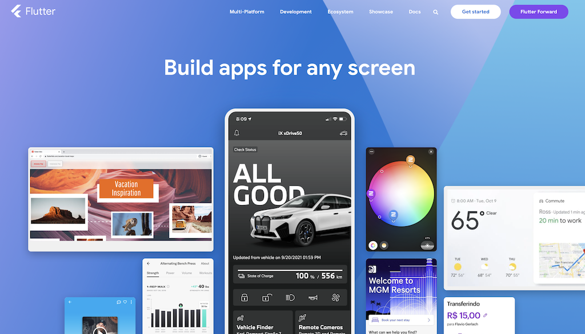
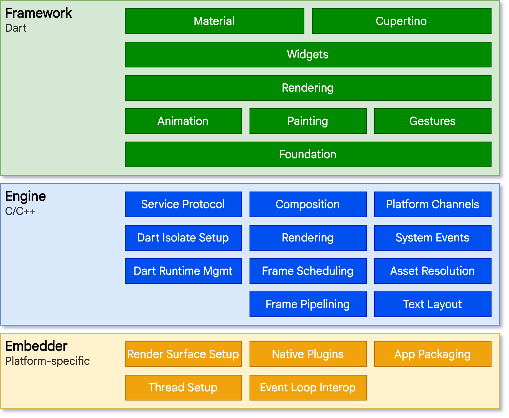

# Flutter 简介

> 本篇内容大部分摘自 [Flutter | FAQ](https://docs.flutter.dev/resources/faq)

## Flutter 理念

> [FAQ | What are Flutter’s guiding principles?](https://docs.flutter.dev/resources/faq#what-are-flutters-guiding-principles)

Flutter 团队相信：

- 为了尽可能多得接触到潜在用户，开发者需要开发多个平台的应用。
- HTML 技术相关的自动行为和历史遗留问题让达到高帧率和精准的用户体验很有难度。
- 开发多平台应用需要不同的团队、不同的代码库、不同的工作流、不同的工具，成本非常高。
- 开发者希望有一种简单优雅的方式使用单一代码库来完成高质量、可控、高性能的多平台应用的开发。

因此 Flutter 团队聚焦于：

- 「控制」：开发者能够掌握控制系统的所有层级。
- 「性能」：用户希望流畅的、及时响应的、不会卡顿的应用。
- 「精准」：每个人都希望有精确的、华丽的、开心的应用体验。

基于上述理念，Flutter 被创造出来。

## Flutter

> [FAQ | What is Flutter?](https://docs.flutter.dev/resources/faq#what-is-flutter)
> 
> Flutter is Google’s portable UI toolkit for crafting beautiful, natively compiled applications for mobile, web, and desktop from a single codebase. Flutter works with existing code, is used by developers and organizations around the world, and is free and open source.

从上面的介绍中可以看到 Flutter 有着以下的特点：

- UI 框架：Flutter 是 Google 制作的一款 UI 框架 / 应用开发框架。
- 全平台部署：Flutter 应用会被编译为平台原生机器码，支持移动端、网页端、桌面端。
- 可扩展性强：可以与现有的平台代码一起使用，Flutter 嵌入已有框架或已有框架嵌入 Flutter。
- 开源免费：企业可以基于 Flutter 定制框架；开源社区共同的努力降低使用门槛。

[Flutter 官网](https://flutter.dev)



## 声明式

> [Flutter | Introduction to declarative UI](https://docs.flutter.dev/get-started/flutter-for/declarative)

与声明式（declarative）相对的是命令式（imperative），很多原生的应用开发框架都是命令式的，比如 Android 原生、iOS UIKit、win32。命令式一般会通过程序的顺序执行来设定 UI：比如需要呈现一个文字标签，你需要创建一个实例 `myLabel`，然后调用 show 方法，如 `myLabel.show()`；要改变 `myLabel` 的内容，你需要通过改变这个实例的属性来做到，如 `myLabel.text = "Hello!"`。在构建一个现代的复杂 UI 时，使用命令式很容易造成 UI 因为程序的先后执行顺序而出现问题，同时代码缺少清晰的 UI 层级关系、代码量也比较大；当然优点是你可以对 UI 做到几乎完全的掌控，因为你在用程序来描述用户界面。

很多技术的发展，都会让开发者逐渐从「编程」转变为「写配置文件」。举个例子，在服务器反向代理的配置的过程中，现在我们一般都会直接去编写 Nginx 的配置文件，而不是去做 socket 编程；在编写神经网络的时候，早期我们需要用代码来描述各层之间的计算关系，现在我们借助框架只需要用一个列表将所有层的配置写出，让框架做剩下的事情就可以了。应用开发也是一样的，声明式的开发方式与「写配置文件」类似，随着技术的发展，从 2019 年开始，很多声明式的应用开发框架出现：如 Google 推出的全平台框架 Flutter，Apple 推出的苹果平台开发框架 SwiftUI，还有 Jetpack Compose 现在已经成为 Android 官方推荐的构建新应用的框架。使用这些框架，能够省去很多编写逻辑代码的时间，而是变成了编写结构性的代码，UI 的层级结构在代码文件中也可以看的更清楚，UI 出现的问题也相对减少了。

声明式与命令式的一个比较大的区别是，声明式的框架通过状态来渲染用户界面。比如一个输入框，其中填入的文字就是一个状态（String），这个状态改变，UI 刷新；比如整个 app 的设置，其中有一个黑夜模式的开关，这就是一个状态（bool），当用户调整模式，应用框架也会对整个 app 与这个状态有关的 UI 进行刷新。也即：

```
UI = f(state)
```

在 Flutter 中，这个 `f()` 就是 `build()`。我们在后面会详细说明。

## Flutter 架构

> [FAQ | Does Flutter come with a framework?](https://docs.flutter.dev/resources/faq#does-flutter-come-with-a-framework)
> 
> Flutter’s framework is designed to be layered and customizable (and optional). Developers can choose to use only parts of the framework, or even replace upper layers of the framework entirely.

> [Flutter | Flutter architectural overview](https://docs.flutter.dev/resources/architectural-overview)
>
> Flutter is designed as an extensible, layered system. It exists as a series of independent libraries that each depend on the underlying layer. No layer has privileged access to the layer below, and every part of the framework level is designed to be optional and replaceable.

可以看到 Flutter 框架本身有着比较好的分层特性。



因为 Flutter 是全平台的框架，其支持应用运行于各个平台，最底层处理的是与各个操作系统的兼容；中间层则是渲染引擎；最上层可以说是用 Dart 为开发者暴露出的 API，包含 Dart 的核心库，以及常用的 widgets。

## Flutter SDK

SDK - Software Development Kit - 软件开发套件

> [FAQ | What is inside the Flutter SDK?](https://docs.flutter.dev/resources/faq#what-is-inside-the-flutter-sdk)
> 
> Flutter includes:
> 
> - Heavily optimized, mobile-first 2D rendering engine with excellent support for text
> - Modern react-style framework
> - Rich set of widgets implementing Material Design and iOS-style
> - APIs for unit and integration tests
> - Interop and plugin APIs to connect to the system and 3rd-party SDKs
> - Headless test runner for running tests on Windows, Linux, and Mac
> - Dart DevTools for testing, debugging, and profiling your app
> - Command-line tools for creating, building, testing, and compiling your apps

- Flutter 底层使用高性能的 2D 渲染引擎来实现界面的渲染
    - Flutter 底层使用了 [Skia](https://skia.org) 这一款 2D 渲染引擎。-- [FAQ | What technology is Flutter built with?](https://docs.flutter.dev/resources/faq#what-technology-is-flutter-built-with)。
    - 在 [FAQ | What kind of app performance can I expect?](https://docs.flutter.dev/resources/faq#what-kind-of-app-performance-can-i-expect) 中提到，Flutter 可以支持 60 Hz 的界面刷新。事实上在支持更高帧率的机型上，Flutter开源社区也有相应的适配，比如在 Apple 推出的 ProMotion 机型上，Flutter 使用底层的 Metal 图形框架渲染让应用能够达到 120 Hz 的刷新率。
    - Flutter 目前还不支持3D的渲染，这是因为 Flutter 聚焦应用开发，一般都是2D的。-- [FAQ | Can I build 3D (OpenGL) apps with Flutter?](https://docs.flutter.dev/resources/faq#can-i-build-3d-opengl-apps-with-flutter)
    - 对 Flutter 框架的内部实现感兴趣的同学可以查看 [Flutter | Architectural overview](https://docs.flutter.dev/resources/architectural-overview)。对三维渲染感兴趣的同学可以学习 [GAMES101 - 现代计算机图形学入门](https://www.bilibili.com/video/BV1X7411F744/) 了解理论知识。对 3D 游戏引擎实现感兴趣的同学可以学习 [GAMES104 - 现代游戏引擎：从入门到实践](https://www.bilibili.com/video/BV1oU4y1R7Km/)。
- Flutter 借鉴了 [React](https://reactjs.org) 框架的思想。
    - 这是一种组件化的思想，每个 UI 组件有着自己的状态，当状态改变时，UI 组件重新渲染。这一点我们在第四节课会展开讲。
- Flutter 官方库中实现了很多常用的有目标平台风格的组件。
    - Flutter 并不使用目标平台的原生组件，而是调用目标平台的底层图形 API 从零渲染，这一点与例如 Unity 之类的框架是一样的。-- [FAQ | Does Flutter use my operating system’s built-in platform widgets?](https://docs.flutter.dev/resources/faq#does-flutter-use-my-operating-systems-built-in-platform-widgets)
- Flutter 包含单元测试和整体测试的 API。
    - 现代软件开发有个比较重要的思想：面向测试开发。测试在很大程度上能够保证软件的质量。Flutter 中可以很方便的对逻辑、UI 进行测试，这一点我们在第七节课会提到。
- Flutter 支持通过平台原生代码调用系统底层 SDK，也有着插件系统支持第三方插件。
- Flutter 提供了易用的 Windows Linux Mac 平台的测试器。
    - 关于 headless 可以查看 [Blog | Getting Started with Headless Chrome](https://developer.chrome.com/blog/headless-chrome/)，简单来说是指一个不含 GUI 的完整命令行环境。
- Flutter 包含 Dart 语言开发工具以支持测试、调试、监视应用。
- Flutter 提供用来创建、构建、测试、编译应用的命令行工具，主要是 `fluter` 和 `dart`。

## Flutter 编程范式

> [FAQ | What programming paradigm does Flutter’s framework use?](https://docs.flutter.dev/resources/faq#what-programming-paradigm-does-flutters-framework-use)

Flutter 使用了下面多种编程范式（不分先后顺序）：

- 渐进式组合（aggressive composition）：通过小的组件组合逐层组合形成完整系统。
- 函数式（functional）：很多东西都以函数呈现，比如一个 Widget 可以理解为从参数到 UI 的一个映射。
- 事件驱动（event-driven）：使用事件和回调函数来处理用户输入。
- 基于类的面向对象（class-based object-oriented）：使用继承定义组件。
- 基于原型的面向对象（prototype-based object-oriented）：原型代码可以在多个平台适用。
- 命令式（imperative）：最直观的编程方式。比如在测试阶段使用。
- 应变性（reactive）：高效应对外界输入。
- 声明式（declarative）：用配置来确定组件行为。
- 通用性（generic）：尽可能让一个概念适合多种场景。
- 并发（concurrent）：使用并发和异步的方法来处理需要长时间执行的函数。
- 约束（constraint）：使用约束而不是坐标构建用户界面。

## Flutter 常用命令

你可以通过 [flutter: The Flutter command-line tool](https://docs.flutter.dev/reference/flutter-cli#flutter-commands) 查看 flutter 命令行工具的所有参数及其说明。

常用的命令如下：

```sh
# 查看命令行帮助
flutter --help

# 检查 Flutter 的安装环境
flutter doctor

# 查看 Flutter 开发套件的版本
flutter --version
# 升级 Flutter
flutter upgrade
```

```sh
# 创建一个新的 Flutter 项目
flutter create <project_name>

# 列出已连接的设备
flutter devices

# 以调试模式使用 Chrome 运行应用
flutter run -d chrome
flutter run -d chrome --web-renderer html
# 以发布模式使用 Chrome 运行应用
flutter run -d chrome --release
# 注：-d 后接已连接设备的名称的前几个字母即可

# 构建应用（subcommands: apk web）
flutter build <subcommand>
flutter build <subcommand> --release

# 清理当前的工程（删除缓存和构建文件）
flutter clean
```

## Dart 语言

> [FAQ | Why did Flutter choose to use Dart?](https://docs.flutter.dev/resources/faq#why-did-flutter-choose-to-use-dart)

Flutter 的开发者们在语言的选择上综合考虑了 Flutter 开发者、应用开发者、用户的体验。Dart 被创建成为 Flutter 使用的语言，有这下面几点原因：

- 开发效率高（Developer productivity）
- 面向对象（Object-orientation）
- 可预测的高性能（Predictable, high performance）
- 高速内存申请（Fast allocation）

这里并未展开说，具体内容可以点击上面的链接查看原文。我们在下一节课会带大家了解 Dart 的基础知识和语法。
