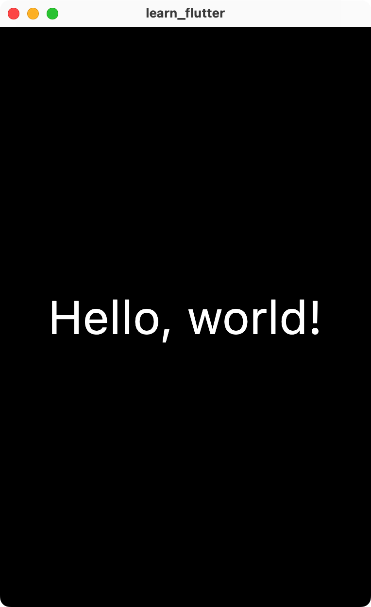
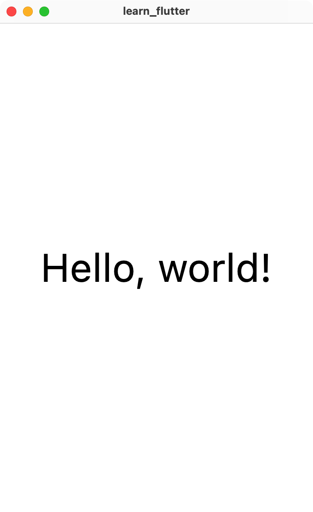

# 有状态的 Widgets

## 状态

### 声明式框架的渲染方式

```
UI = f(states)
```

状态决定 UI，这是声明式的框架所特有的（在传统的命令式编程中，UI 的改变由函数调用控制）。具体来说：

- 当前时刻的用户界面由当前时刻的状态通过函数 `f()` 渲染得到。
    - 在 Flutter 中，Widget 的 `build()` 函数组成这个 `f()`。
    - 也就是说，除了修改状态，不会有其他的方式对用户界面造成修改。唯一的一条路径能够减少应用中的逻辑链，相对简洁。
- 状态是自变量，当状态改变时，用户界面随之改变。
    - 结合屏幕刷新率考虑，60 Hz 的屏幕至少要在 1/60 s 内判断 states 是否发生改变，如果发生改变要重新调用 `f()` 来重新渲染新的用户界面。
    - 注意，不是根据 states 的变化修改旧的用户界面，而是将旧的用户界面直接抛弃，重新渲染新的用户界面。这样做确实会降低应用的渲染效率，但由于 Flutter 对 `build()` 函数做过相当多的优化，开发者绝大多数情况并不用担心性能。
    - 在 Flutter 中，在 `StatefulWidget` 中改变状态需要调用 `setState()`。
- 一个 Widget 不能直接更新其他 Widget，而是通过更新状态来更新另一个 Widget
    - 这样做保证 Widget 之间的强耦合较少，Widget 能够比较好的进行复用。

### 什么是状态

那么什么是状态呢？简单来说就是一些变量值：

- 黑夜模式的开关（`bool isDarkModeOn`）
    - 为 `true` 时开关呈现开启状态，界面呈现黑夜模式
    - 为 `false` 时开关呈现关闭状态，界面
- 用户购物车中的商品（`List<Item> itemsInCart`）
    - 用户添加商品到购物车时给列表中添加项，购物车按照新的列表重新刷新界面
- 游戏中角色的血量（`double hp`）
    - 角色受到攻击时血量减少，界面的血条减少，游戏角色的速度可能会变慢
    - 用户点击回血道具，血量增加，界面的血条增加
- ...

你甚至可以认为应用内的所有数据都是状态。

### 短暂状态与应用状态

状态分为短暂状态（ephemeral state）和应用状态（app state），但是这并没有明确的界限。如果一个状态在整个应用的多个 Widget 中都要使用（比如黑夜模式的开关），那么它相对靠近应用状态一些；如果一个状态只是在一个 Widget （动画的计时器）或者相邻的两个 Widget（多选框的选择结果要在当前界面呈现）中使用，那么它相对靠近短暂状态。

短暂的状态我们使用 `StatefulWidget` 进行处理，应用状态我们主要使用第三方状态管理包 `Provider` 进行处理。

## StatefulWidget

### 原理

一个最简单的 `StatefulWidget` 框架如下：

```dart
class MyWidget extends StatefulWidget {
  const MyWidget({super.key});

  @override
  State<MyWidget> createState() => _MyWidgetState();
}

class _MyWidgetState extends State<MyWidget> {
  @override
  Widget build(BuildContext context) {
    return const Placeholder();
  }
}
```

### 案例

> 注：在 VS Code 中
> 
> - 敲 `stf` 回车即可自动补全 `StatefulWidget`。
> - 右键一个 `StatelessWidget` 选择 Refactor... 可以将其转换为 `StatefulWidget`。
> - 右键一个 `StatefulWidget` 选择 Refactor... 可以将其转换为 `StatelessWidget`。

我们用一个非常简单的黑夜模式开关的案例来对 `StatefulWidget` 进行说明。

#### StatelessWidget

```dart
import 'package:flutter/material.dart';

void main() {
  runApp(
    MaterialApp(
      home: Scaffold(
        body: MyPage(
          isDarkModeOn: true,
        ),
      ),
      debugShowCheckedModeBanner: false,
    ),
  );
}

class MyPage extends StatelessWidget {
  final bool isDarkModeOn;

  MyPage({super.key, required this.isDarkModeOn});

  @override
  Widget build(BuildContext context) {
    return Container(
      color: isDarkModeOn ? Colors.black : Colors.white,
      child: Center(
        child: Text(
          "Hello, world!",
          style: TextStyle(
              color: isDarkModeOn ? Colors.white : Colors.black, fontSize: 48),
        ),
      ),
    );
  }
}
```

这里展示了一个最简单的黑夜模式的开关的案例，黑夜模式开则黑底白字，关则白底黑字。

由于这里 `MyPage` 是 `StatelessWidget`，可以看到其参数 `bool isDarkModeOn` 被标记为 `final`，也就是只能被赋值一次。在初始化 `MyPage` 的时候，必须传入 `isDarkModeOn` 这个参数。每当传入的参数改变时，`MyPage` 就会被重新实例化，可以说，`StatelessWidget` 的 `build()` 只会执行一次。

这时我们要修改暗夜模式，只能在代码中 `MyPage` 实例化的地方进行修改，然后使用热加载重启应用。

如果我们希望添加一个开关来让用户修改黑夜模式，那么我们至少需要一个变量 `isDarkModeOn`，在 Flutter 中，普通的变量难以和用户界面的刷新直接关联，最推荐的方式是将 `MyPage` 变为一个 `StatefulWidget`，然后将 `isDartModeOn` 从参数变为一个状态。

#### StatefulWidget

下面是用 `StatefulWidget` 重写的黑夜模式案例：

```dart
import 'package:flutter/material.dart';

void main() {
  runApp(
    MaterialApp(
      home: Scaffold(
        body: MyPage(
          isDarkModeOnDefault: true,
        ),
      ),
      debugShowCheckedModeBanner: false,
    ),
  );
}

class MyPage extends StatefulWidget {
  final bool isDarkModeOnDefault;

  MyPage({super.key, required this.isDarkModeOnDefault});

  @override
  State<MyPage> createState() => _MyPageState();
}

class _MyPageState extends State<MyPage> {
  late bool isDarkModeOn;

  @override
  void initState() {
    super.initState();
    isDarkModeOn = widget.isDarkModeOnDefault;
  }

  @override
  Widget build(BuildContext context) {
    return GestureDetector(
      onTap: () {
        setState(() {
          isDarkModeOn = !isDarkModeOn;
        });
      },
      child: Container(
        color: isDarkModeOn ? Colors.black : Colors.white,
        child: Center(
          child: Text(
            "Hello, world!",
            style: TextStyle(
                color: isDarkModeOn ? Colors.white : Colors.black,
                fontSize: 48),
          ),
        ),
      ),
    );
  }
}
```

- 我们首先关注 `_MyPageState` 中的变量 `bool isDarkModeOn`，它是一个状态，我们使用这个状态来控制背景和文字的颜色。
    - 我们为 `MyPage` 添加了一个参数名为 `isDarkModeOnDefault`，这个参数只会传入一次。
    - 在 `initState()` 中，状态 `isDarkModeOn` 的初值被赋为 `isDarkModeOnDefault`（使用 `widget.xxx` 来获取参数）。由于赋值在声明之后，我们需要使用 `late` 关键字标记 `isDarkModeOn`。
- 在 `Container` 外部，我们使用 `GestureDetector` 添加一个点击回调函数，其中使用 `setState()` 来改变 `isDarkModeOn` 的值。




事实上，我们可以发现当 `isDarkModeOn` 被作为一个状态之后，`_MyPageState` 的 `build()` 相当于一个 `StatelessWidget`，我们可以进一步做封装，变为类似上面的 `StatelessWidget` 案例的样子：

```dart
import 'package:flutter/material.dart';

void main() {
  runApp(
    MaterialApp(
      home: Scaffold(
        body: MyStatefulPage(
          isDarkModeOnDefault: true,
        ),
      ),
      debugShowCheckedModeBanner: false,
    ),
  );
}

class MyStatefulPage extends StatefulWidget {
  final bool isDarkModeOnDefault;

  MyStatefulPage({super.key, required this.isDarkModeOnDefault});

  @override
  State<MyStatefulPage> createState() => _MyStatefulPageState();
}

class _MyStatefulPageState extends State<MyStatefulPage> {
  late bool isDarkModeOn;

  @override
  void initState() {
    super.initState();
    isDarkModeOn = widget.isDarkModeOnDefault;
  }

  @override
  Widget build(BuildContext context) {
    return GestureDetector(
      onTap: () {
        setState(() {
          isDarkModeOn = !isDarkModeOn;
        });
      },
      child: MyStatelessPage(
        isDarkModeOn: isDarkModeOn,
      ),
    );
  }
}

class MyStatelessPage extends StatelessWidget {
  final bool isDarkModeOn;

  MyStatelessPage({super.key, required this.isDarkModeOn});

  @override
  Widget build(BuildContext context) {
    return Container(
      color: isDarkModeOn ? Colors.black : Colors.white,
      child: Center(
        child: Text(
          "Hello, world!",
          style: TextStyle(
              color: isDarkModeOn ? Colors.white : Colors.black, fontSize: 48),
        ),
      ),
    );
  }
}
```

可以看到，`MyStatelessPage` 变成了可复用的 Widget，而我们的应用只是添加了一个状态层 `MyStatefulPage`，并将状态 `isDarkModeOn` 传入 `MyStatelessPage`。类似这样将状态层和无状态的用户界面分开构建应用，结构会更清晰一些。

#### 备注

注：上述案例将黑夜模式的设置放到应用内。但结合操作系统的黑夜模式设置，应用跟随系统设置决定是否使用黑夜模式更符合用户操作直觉一些。

## Provider

> Declarative UI frameworks eliminate whole classes of bugs. But they can also be a puzzle until you figure out how to structure your app logic around them. -- [YouTube | Pragmatic State Management in Flutter (Google I/O'19)](https://www.youtube.com/watch?v=d_m5csmrf7I)

状态管理是声明式框架非常核心也是比较复杂的一块内容，在 [List of state management approaches](https://docs.flutter.dev/development/data-and-backend/state-mgmt/options) 中官方介绍了很多进行状态管理的第三方包，可以看到第三方包的数量非常多，可以说是各有优劣。

本课程选取 [Provider](https://pub.dev/packages/provider) 进行教学，这是官方推荐的一个状态管理包，对于初学者来说也足够简单易用。

在项目中添加 `Provider` 需要在 `pubspec.yaml` 的 `dependencies:` 中添加 `provider:`。在对应的文件首添加 `import 'package:provider/provider.dart';`。

### 原理

#### 创建 Model 类

在 Provider 中，我们会使用一个继承 `ChangeNotifier` 的类来管理状态，这个类的方法对状态进行修改，当状态的改变需要使得界面重新渲染时，调用 `notifyListeners()` 来通知对应的 Widget 进行渲染（即重新调用 `build()`）。例如：

```dart
class MyModel extends ChangeNotifier {
  MyState state;

  void changeState(MyState newState) {
    state = newState;
    notifyListeners();
  }
}
```

#### 创建 Model 实例

整个 UI 结构是一个树的结构，一个状态可能被多个 Widget 使用，那么这个状态创建的位置应该在这些 Widget 共同的上方。`ChangeNotifierProvider` 是一个 Widget，只需要将需要使用状态的 Widget 放到 `ChangeNotifierProvider` 的下方即可。创建的方式如下：

```dart
ChangeNotifierProvider(
  create: (context) => MyModel(),
  child: MyWidget()
)
```

#### 使用状态

对于使用（读取和修改）这个状态的 Widget，需要去订阅这个状态的更改（也即接收 `notifyListeners()` 传递的信号），同时也应该能够接收到状态的值。这两个功能由 `Consumer<MyModel>(builder: (context, model, child){ ... })` 或 `Provider.of<MyModel>(context)` 实现：

```dart
class MyPage extends StatelessWidget {
  MyPage({super.key});

  @override
  Widget build(BuildContext context) {
    return Consumer<MyModel>(
      builder: (context, model, child) {
        return WidgetBuiltBy(model.state);
      },
    );
  }
}
```

```dart
class MyWidget extends StatelessWidget {
  MyWidget({super.key});

  @override
  Widget build(BuildContext context) {
    return WidgetBuiltBy(Provider.of<MyModel>(context).state);
  }
}
```

### 案例

接下来我们将上面用 `StatefulWidget` 构建的黑夜模式案例改为用 `Provider` 构建：

```dart
import 'package:flutter/material.dart';
import 'package:provider/provider.dart';

void main() {
  runApp(
    MaterialApp(
      home: Scaffold(
        body: ChangeNotifierProvider(
            create: (context) => MyPageModel(isDarkModeOnDefault: false),
            child: MyPage()),
      ),
      debugShowCheckedModeBanner: false,
    ),
  );
}

class MyPageModel extends ChangeNotifier {
  late bool isDarkModeOn;

  MyPageModel({required bool isDarkModeOnDefault}) {
    isDarkModeOn = isDarkModeOnDefault;
  }

  void toggleDarkMode() {
    isDarkModeOn = !isDarkModeOn;
    notifyListeners();
  }
}

class MyPage extends StatelessWidget {
  const MyPage({super.key});

  @override
  Widget build(BuildContext context) {
    return Consumer<MyPageModel>(builder: (context, model, child) {
      return GestureDetector(
        onTap: () {
          model.toggleDarkMode();
        },
        child: Container(
          color: model.isDarkModeOn ? Colors.black : Colors.white,
          child: Center(
            child: Text(
              "Hello, world!",
              style: TextStyle(
                  color: model.isDarkModeOn ? Colors.white : Colors.black,
                  fontSize: 48),
            ),
          ),
        ),
      );
    });
  }
}
```

### 进阶使用

更多的使用方法在 [Provider 的 README](https://pub.dev/packages/provider#usage) 中介绍的比较详细，下面简单提及。

- 如果整个应用有很多的状态，最好将他们拆分为很多个小的状态，而不要写在一个大类中。
- 你可以使用 `MultiProvider` 从一个树结点添加多个 Model。
- 你可以使用 [StreamProvider](https://pub.dartlang.org/documentation/provider/latest/provider/StreamProvider-class.html) 来监听流。

## References

- https://docs.flutter.dev/development/data-and-backend/state-mgmt/declarative
- https://docs.flutter.dev/development/data-and-backend/state-mgmt/ephemeral-vs-app
- https://docs.flutter.dev/development/data-and-backend/state-mgmt/simple
- https://docs.flutter.dev/development/data-and-backend/state-mgmt/options
- https://www.youtube.com/watch?v=d_m5csmrf7I
