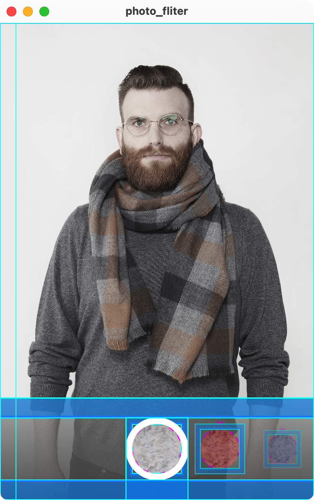

# 实际案例

这一节课我们通过三个稍微炫酷一些的案例来综合前面讲过的所有知识，包括 Flutter 中 常用 Widgets、状态管理、布局与约束、动画这些核心知识点。

## 拖拽点餐

案例代码 [GitHub | drag_to_order](https://github.com/thu-mobile-dev/drag_to_order)

> 此案例源自 [Flutter Cookbook | Effects: Drag a UI element](https://docs.flutter.dev/cookbook/effects/drag-a-widget)。
>
> 案例中使用的图片来自 [原神 BWIKI](https://wiki.biligame.com/ys/)
>
> 代码中使用 separate widgets 而不是官方代码中的 helper methods 组织用户界面代码。关于这两种代码组织结构，可以参考 [Stack Overflow | What is the difference between functions and classes to create reusable widgets?](https://stackoverflow.com/a/53234826/14298786) 和 [YouTube | Widgets vs helper methods | Decoding Flutter](https://www.youtube.com/watch?v=IOyq-eTRhvo)。

### 简介

长按拖拽（drag-and-drop）在手机的手势操作中算是非常常见的操作：比如发微信朋友圈的时候长按拖拽调整图片顺序、在文件管理器中将文件拖入文件夹...我们来通过一个拖拽点餐的完整案例来学习在 Flutter 中实现该功能的方法。

我们希望做出的拖拽点餐的效果大概是这样的：


可以看到，应用界面主要分为上方的菜单和下方的顾客栏，菜单中每个食物显示一行，包含图片、名称和价格，顾客栏则包含顾客头像、名字、价格、已点的菜品数量：

{width="300"}

当用户长按上方的某个食物时，界面上会多出一个半透明的食物图片跟着用户手指移动：

{width="300"}

当食物被拖拽到下方顾客处，顾客的名片会高亮，此时松手即算作对应的顾客点一份视频：

{width="300"}

同时下方每位顾客的食物总金额也会被计算得到：

{width="300"}

此示例的核心知识点有：

- 使用 Row、Column、SizedBox 等基础元素进行界面布局
- 长按拖拽功能

### 整体讲解

代码总共包含两个源文件：`lib/main.dart`（界面部分）和 `lib/model.dart`（数据部分）。

#### 数据部分

在 `lib/main.dart` 中，定义了类 `Item` 和 `Customer` 分别表示食物和顾客。同时定义了两个全局变量`test_items` 和 `test_customers` 放置示例（使用全局变量并不是一个好习惯，当你的数据需要与用户界面产生关联时（数据需要渲染在屏幕上时），最好使用 `StatefulWidget` 或者 `Provider` 之类的框架定义状态，确保 Flutter 在数据变化时能够正确渲染）。

#### 界面部分

应用整体是一个普通的单页应用，`MaterialApp` 套了单个 `Scaffold`。

在 `FoodStallOrderMenu` 中使用 `Column` 组织起上方的食品菜单 `ItemsView` 和下方的顾客栏 `CustomersView`。

接下来从较小的 Widget 看起：`ItemView` 和 `CustomerView` 分别代表单个食品和顾客的 Widget；将 `ItemView` 放入一个 `ListView` 即组成了 `ItemsView`，将 `CustomerView` 放入一个 `Row` 即组成了 `CustomersView`。

我们实现的拖拽功能集于上面所说的用户界面实现。Flutter 中，长按拖拽需要：

- 添加三个 Widget
    - 给被拖拽的 Widget 包裹 `LongPressDraggable`（`DraggableItemView`）
    - 拖拽提示的 Widget（`DraggingItemView`）
    - 给拖拽目标的 Widget 包裹 `DragTarget`（`DroppableCustomerView`）
- 使用范型添加拖拽传递的数据类型，如 `LongPressDraggable<Item>` 和 `DragTarget<Item>`

### 拖拽功能详解

#### DraggableItemView

`LongPressDraggable<Item>` 的参数比较简洁明了：

- `data` 拖拽过程中传输的数据。
- `dragAnchorStrategy` 拖拽使用的方法，`pointerDragAnchorStrategy` 表示 `DraggingItemView` 随着手指的移动而移动。
- `feedback` 为拖拽过程中显示的图片/图标。

#### DraggingItemView

`DraggingItemView` 用一个普通的 `ClipRRect` 来显示图片。

关于 `FractionalTranslation`：代码中使用的参数是 `translation: const Offset(-0.5, -0.5)`，同学们可以将这个值调整为 `Offset(0.0, 0.0)`，这时半透明的食物图片会在手的右下方。`FractionalTranslation` 相当于是给 `ClipRRect` 加了一个向左上角一半宽一般长的偏移。

#### DroppableCustomerView

`candidateItems` 为拖拽至区域中的数据。当用户松开手指，`onAccept` 被调用，食物被添加到顾客的 `items` 中。

## 多态下载按钮

案例代码 [GitHub | multi_state_download_button](https://github.com/thu-mobile-dev/multi_state_download_button)

> 此案例源自 [Flutter Cookbook | Create a download button](https://docs.flutter.dev/cookbook/effects/download-button)。

在 App Store 中下载应用基本上有下面这样的动画效果：


这个案例我们就用 Flutter 构建这个下载按钮。

首先可以看到，这个按钮有几个阶段：

```dart
enum DownloadStatus {
  notDownloaded, // 尚未下载、按钮显示「下载」
  fetchingDownload, // 正在连接服务器获取下载内容、按钮转圈（isFetching）
  downloading, // 正在下载、按钮以蓝色圆圈呈现下载进度（isDownloading）
  downloaded, // 已下载、按钮显示「打开」（isDownloaded）
}
```

在这个案例中，我们首先要分别做出这四个状态对应的样式，然后考虑添加它们之间的动画衔接。

### 整体结构

应用整体是一个单页应用，居中显示 `MultiStateDownloadButton`。这是一个 `StatefulWidget`，状态为 `_downloadController` 下载的各个阶段，使用 `SimulatedDownloadController` 封装。

在 `ButtonShapeWidget` 中，`opacity: isDownloading || isFetching ? 0.0 : 1.0`（0.0 表示透明） 以及 `Text(isDownloaded ? "打开" : "下载",` 决定了「下载」和「打开」只在对应的阶段显示，正在获取和正在下载时隐藏。

在 `ProgressIndicatorWidget` 中，使用了 Material Design 的组件 `CircularProgressIndicator`，可以看到其一个参数为 `value: isFetching ? null : progress`，在获取信息的时候， `value` 为 `null`，`CircularProgressIndicator` 不断转圈；在下载时则显示进度。

在 `MultiStateDownloadButton` 中，则使用 `Stack` 将二者放在一起，通过透明度决定谁要被显示，可以说是比较简单但不失精巧的设计了。

注：关于下载。该案例并没有下载任何东西，而是使用 Dart 的一些异步 API 模拟了下载过程，在 `_doSimulatedDownload()` 可以看到完整的代码。

### 动画讲解

我们可以看到，`DownloadButton` 是一个 `StatelessWidget`。下载状态的存储和更新是在 `_downloadController` 中。`SimulatedDownloadController` 是一个 `ChangeNotifier`，在函数 `_doSimulatedDownload()` 中，每当 `_downloadController.downloadStatus` 或 `_downloadController.progress` 更新时，调用 `notifyListeners()`，从而使得 `AnimatedBuilder` 重新渲染 `DownloadButton`。

代码中还使用了三处 [`AnimatedWidget`](https://api.flutter.dev/flutter/widgets/AnimatedWidget-class.html)，两个 `AnimatedOpacity` 是为了让各个阶段出现和消失的更流畅，`AnimatedContainer` 则是使用动画去使得比较生硬的形状更改变流畅。

### 动态界面大小

此示例为了方便展示，需要一个比较大的按钮，通过常数来调整按钮大小不够简洁，我们希望能够适配不同的设备屏幕大小，以比例的形式呈现按钮，这样在电脑端展示的时候，可以通过放大窗口来让按钮变大。

这一个功能主要在 `lib/extension.dart` 中实现，核心是 `MediaQuery.of(context).size.width/height` 获取屏幕 / 窗口的长款，取短边然后乘以对应的倍数呈现界面中的元素，如：

```dart
Icon(
  Icons.stop,
  size: ScreenSize.shorterSide(context, percentage: 1 / 2 * 1 / 4),
  color: Colors.blue,
),
```

注：对于普通文字的大小调整，使用 `Theme` 进行管理是更好的选择。

## 简易照片滤镜

案例代码 [GitHub | photo_filter](https://github.com/thu-mobile-dev/photo_filter)

> 此案例源自 [Flutter Cookbook | Create a photo filter carousel](https://docs.flutter.dev/cookbook/effects/photo-filter-carousel)，为了呈现更加清晰的结构，修改的地方比较多。


可以看到界面主要是两层，背景是一张图片，上面在下方有一个颜色选择栏，选择对应的颜色会给图片添加滤镜。选择颜色时可以点击选择，或者左右拨动选择（电脑端不支持鼠标左右拖拽拨动，而是使用默认的滚动方式（如鼠标滚轮或触控板滑动））。在颜色选择的过程中，越靠近中间的颜色大小越大。

此案例的主要知识点：

- Flutter 约束和布局规则 Constraints go down. Sizes go up. Parent sets position.
- `Scrollable` 的使用
- `Flow` 对子 Widget 的布局
- 回调函数在父子 Widget 间的传递

### 整体结构

应用整体为单页，使用 `MaterialApp` 包裹 `PhotoWithFilterPage`。

`PhotoWithFilterPage` 使用 `Stack`，呈现出背景有颜色滤镜的图片 `PhotoWithFilterView`（目前使用项目中的资源图片），下方的选色器 `ColorSelectorView` 为一个整体。可以看到，`PhotoWithFilterPage` 是一个 `StatefulWidget`，其中状态为 `selectedColor`，`ColorSelectorView` 通过回调函数 `onColorSelected` 对状态进行修改，`PhotoWithFilterView` 对状态进行使用。

### ColorSelectorView

分析下方的选色器 `ColorSelectorView`，主要由三层构成：中间一层是一个可以左右滑动的 `ColorsView`，主要使用 `Scrollable`，使用与 `PageView` 类似的逻辑进行控制，从而实现每次滑动时的吸附动画效果。前面一层 `RingView` 画一个圈，表示当前选中的颜色，始终处于最下方正中间。最后一层是一个从上到下的从透明到黑色的颜色梯度 `ShadowView`，使得选取的背景图片和 `ColorsView` 在视觉上不冲突。

开启 `debugPaintSizeEnabled = true;` 截图如下：

{width="300"}

#### 手势冲突

在 `ColorSelectorView` 的 `Stack` 中，`RingView` 添加了 `IgnorePointer`。这是因为从层级关系上来说，`RingView` 遮挡（拦截）了 `ColorsView` 的滑动手势。使用 `IgnorePointer` 可以使得包裹的 Widget 不接受手势。

#### 使用约束确定大小

这里需要注意一点，我们需要确定下方 `ColorSelectorView` 的高度。代码的逻辑是，通过 `ColorSelectorView.colorCountOnScreen` 来决定 `ColorsView` 在屏幕上呈现多少个 `ColorView`，这样的话一个 `ColorView`（含 `Padding`）的宽度应该是屏幕宽度除以 `ColorSelectorView`。我们使得 `ColorView`（含 `Padding`）的高度和宽度一致即可。为了使得整个 `ColorsView` 有通用性，我们使用 `LayoutBuilder` 拿到 `ColorSelectorView` 的约束 `constraints`，使用 `constraints.maxWidth`（上层 Widget 传给 `ColorSelectorView` 的最大宽度） 计算得到一个 `ColorView` 的高度和宽度。

#### 关于 Padding

`ColorsView` 和 `RingView` 都添加了上下高度为 `verticlePaddingSize` 的 `Padding`。`ShadowView` 则将 `ColorsView` 的背景填满。

`ColorView` 因为要添加 `RingView`，所以添加了和 `RingView` 的圆环宽度大小一样的 `Padding`。

### ColorsView

接下来我们讲解比较核心的 `ColorsView`，主要是由 `Scrollable` 构成 UI，`Scrollable` 保证了全平台统一的滑动体验。

#### Scrollable 的参数

我们先来查看 `Scrollable` 的参数：

- `controller`
    - [`ScrollController`](https://api.flutter.dev/flutter/widgets/Scrollable/controller.html)，`ScrollController` 可以用来设置一个 `Scrollable` 的初始滚动位置 `initialScrollOffset`、读取当前的滚动位置 `offset`、或者用 `animateTo()` 来改变当前的滚动位置。
    - 这里我们使用 `ScrollController` 的子类 `PageController`，来方便的添加 `viewportFraction`。
    - `viewport` 可以理解为“视野”，我们希望 `Scrollable` 在屏幕中的部分呈现出 `colorCountOnScreen` 个 `ColorView`，将 `viewportFraction` 设置为 `1.0 / colorCountOnScreen`。
- `axisDirection` 表示滑动的主轴为向右的轴。
- `physics` 使用 `PageScrollPhysics` 使得在滑动的时候有着类似一页一页滑动的吸附效果。
- `viewportBuilder`
    - `viewportOffset.applyViewportDimension()` 设置 `Scrollable` 在屏幕上显示的长度。
    - `viewportOffset.applyContentDimensions()` 设置可滑动的范围（可以通过这个去隐藏一些边缘的内容），差为内容的总长度。
    - 根据滑动的位置（偏移量） `viewportOffset` 来确定 `Flow` 中的布局。

#### Flow

> [Flow](https://api.flutter.dev/flutter/widgets/Flow-class.html) sizes and positions children efficiently, according to the logic in a [FlowDelegate](https://api.flutter.dev/flutter/rendering/FlowDelegate-class.html).

简单来说，`Flow` 可以对 `children` 实现自定义程度很高的布局，使用者需要对 `FlowDelegate` 中的 `paintChildren()` 进行重载。在 [YouTube | Flow (Flutter Widget of the Week)](https://www.youtube.com/watch?v=NG6pvXpnIso) 中讲的比较直观，配合矩阵可以做出很不错的动画效果。

在 `ColorsViewFlowDelegate` 中 `paintChildren` 的最后，在 `for` 循环中调用 `context.paintChild()` 实现对各个子 Widget 的绘制。具体是一些数学运算，代码中也有英文注释，感兴趣的同学可以自行查看。

#### 交互逻辑

在 `ColorsView` 中，有两套交互逻辑：

- `PageController` 检测到用户翻页（左右滑动），需要对当前位置做四舍五入然后更新 `int _currentPage` 和 `selectedColor` 的值。
    - 实现在 `_ColorsViewState._onPageChanged()` 中。
    - 在 `_ColorsViewState.initState()` 中  `_pageController.addListener(_onPageChanged);` 表示每次 `_pageController` 的 `double page` 值发生改变都会调用 `_onPageChanged()`。
- 用户点击 `ColorView` 进一步调用 `onTap`，从而改变 `int _currentPage` 和 `selectedColor` 的值。
    - 实现在 `_ColorsViewState._onColorSelected()` 中。
    - 在 `_pageController.animateToPage()` 中使用动画呈现滑动效果。
