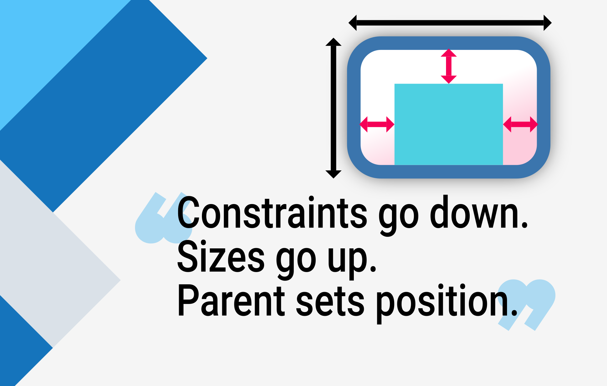
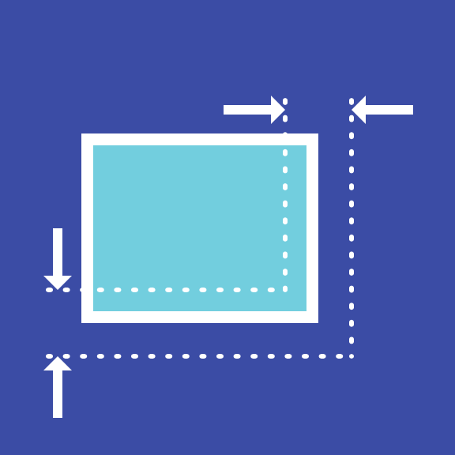
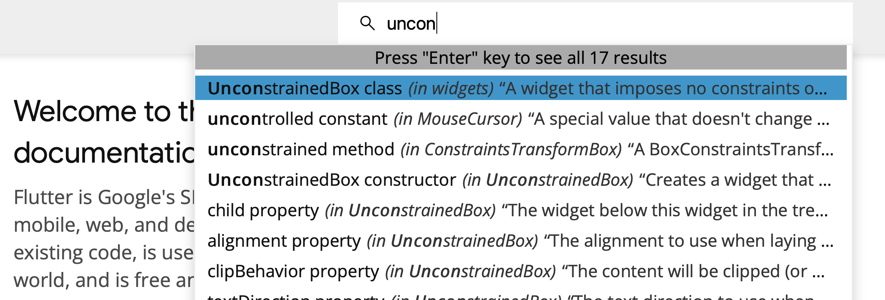

# 布局

在第四课我们认识了一些用来布局的 Widget，比如 Row、Column、Expanded、Align 等，但背后的原理我们并没有细说。可能有同学在课下尝试的时候已经发现一些 Widget 没有呈现自己想要的大小，或者是在调试界面看到了黄黑相见的溢出提示。这节课我们聚焦约束，解释 Flutter 背后布局的原理。

> [Flutter | Understanding constraints](https://docs.flutter.dev/development/ui/layout/constraints)

首先我们需要了解一些概念：

- 「布局 Layout」：每一个 Widget 在屏幕上的大小和位置；Flutter 框架确定每一个 Widget 在屏幕上的大小和位置的过程。
- 「约束 Constraint」：父 Widget 对子 Widget 布局的要求，为 最大/最小 宽度/高度（max/min Width/Height）。
- 「大小 Size」：一个 Widget 在屏幕上的长和宽（width/height）。
- 「位置 Position」：一个 Widget 在屏幕上的位置（x/y）。

有了这些概念，我们就可以了解 Flutter 布局的基本原理：



**Constraints go down. Sizes go up. Parent sets position.**

展开来说，是指：

- 父 Widget 向子 Widget 传递约束。
- 子 Widget 根据设置的大小和父 Widget 传来的约束决定自己的最终大小。
- 父 Widget 确定子 Widget 的位置。

## 案例

看一些比较经典的案例会更容易理解，在 [Flutter | Understanding constraints](https://docs.flutter.dev/development/ui/layout/constraints) 中共有 29 个案例，推荐将其中一千多行的代码复制到本地运行（网页版较卡顿），查看每个案例的效果。

- 1-6 Container & Align
- 7-8 Container & Container
- 9-12 ConstrainedBox
- 13-17 UnconstrainedBox / OverflowBox / LimitedBox
- 18-22 FittedBox & Text
- 23-27 Row / Expaned / Flexible
- 28-29 tight constraints / loose constraints



## 紧约束和松约束

紧约束给出了一个确切的大小：

```dart
BoxConstraints.tight(Size size)
   : minWidth = size.width,
     maxWidth = size.width,
     minHeight = size.height,
     maxHeight = size.height;
```

松约束则只指定最大的大小：

```dart
BoxConstraints.loose(Size size)
   : minWidth = 0.0,
     maxWidth = size.width,
     minHeight = 0.0,
     maxHeight = size.height;
```

## Widget 布局特性

通过上面的例子可以看到，每个 Widget 都有着自己的布局特性，这是由它们本身的功能决定的。你可以通过文档或者源码来了解。

打开 [API 文档](https://api.flutter.dev/index.html) 之后，你可以通过右上角的搜索来找到对应的 Widget。



源码查看则可以使用 VS Code 的跳转功能，按住 ctrl 或者 cmd 点击你感兴趣的 Widget，查看它继承的基类，其中 `createRenderObject()` 和 `performLayout()` 这两个函数与布局最相关，你可能需要多次跳转才能找到。

## 局限

上面所提到的 Constraints go down. Sizes go up. Parent sets position. 有下面的一些局限：

- 一个 Widget 需要结合父 Widget 的约束才能得到其大小，这意味着 Widget 的最终大小很可能和代码中设置的大小不一样。
- 一个 Widget 不会决定也不会知道自己在屏幕中的位置，因为父 Widget 决定子 Widget 的位置。
- 父子 Widget 的约束和大小传递是逐层的，这意味着开发者很难精确控制每一个 Widget 的位置和大小。
- 布局的最后一步是确定位置，需要做到精确，否则子 Widget 的大小可能被忽略。
