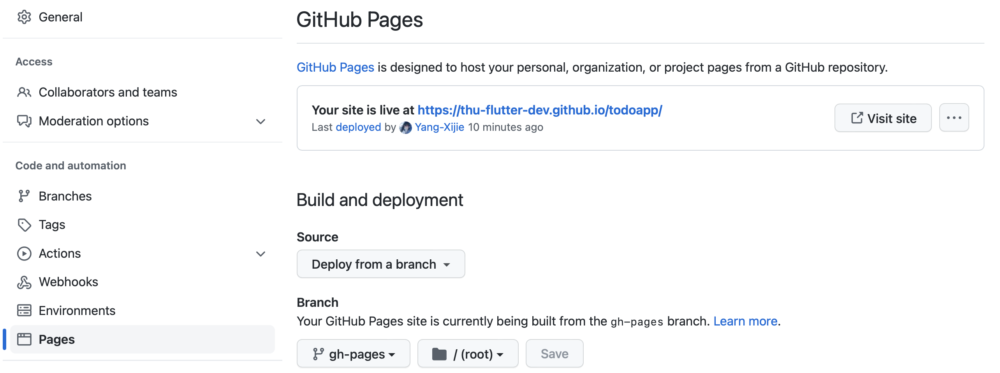
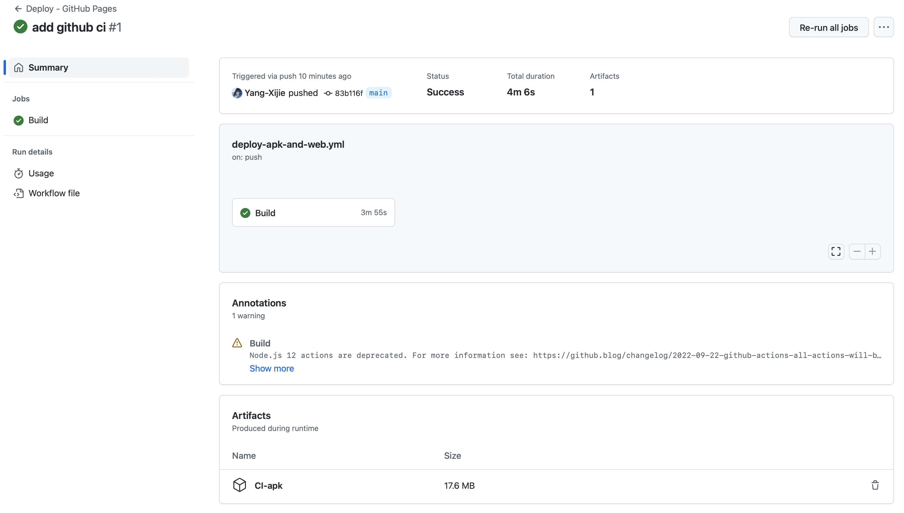

# CI 与 CD

- 持续集成（Continuous integration, CI），一般指在代码发生变化时持续进行测试，确保代码在更改的过程中不出现问题。
- 持续部署（Continuous distribution / deliver, CD），一般指在需要发布应用时借助平台进行自动化部署，节省各个平台发布的操作。

这两个概念个人认为是和 [twelve-factor app](https://12factor.net) 相得益彰的，偏架构设计和工作流管理。

## 基于 Git 和 GitHub 的团队合作开发模式

写代码离不开 Git 的提交和回退功能，Git 的分支功能则方便开多点发和部署，GitHub 作为远端的 Git 仓库，结合很多好用的功能助力团队合作开发。

Flutter 程序基于 GitHub workflows 可以很方便的通过配置文件开启 CI CD 服务，GitHub 提供了一定程度的免费额度，基本上可以满足小团队的应用开发需求。

### 发布网页版和 APK

我们可以将 APK 的构建和网页版的部署变为自动化的流程。

新建 `.github/workflows/` 文件夹，在其中新建文件 `deploy-apk-and-web.yml`，添加如下内容：

```yaml
# Reference: https://github.com/subosito/flutter-action

name: Deploy - GitHub Pages
on:
  push:
    branches:
      - main
  pull_request:
    branches:
      - main
jobs:
  build:
    name: Build
    runs-on: ubuntu-latest
    steps:
    - uses: actions/checkout@v3
    - name: Install Flutter
      uses: subosito/flutter-action@v2
      with:
        channel: 'stable'
    - run: flutter --version
    - run: flutter pub get
    - run: flutter build web --web-renderer html
    - name: Deploy to gh-pages
      uses: peaceiris/actions-gh-pages@v3
      with:
        github_token: ${{ secrets.GITHUB_TOKEN }}
        publish_dir: ./build/web
    - run: flutter build apk
    - uses: actions/upload-artifact@v2
      with:
        name: CI-apk
        path: ./build/app/outputs/apk/release/app-release.apk
```

这个配置文件让 GitHub 在每次有新的代码在主分支提交的时候，自动构建网页版并部署到 GitHub Pages、自动构建 APK 并上传到 GitHub 可以下载。

然后需要对网页端做一些配置，打开 `web/index.html`，将 L17 `<base href="$FLUTTER_BASE_HREF">` 中的 `$FLUTTER_BASE_HREF` 改为 GitHub 上的仓库名字，仓库名字是 `repo_name` 就改为 `<base href="/repo_name/">`。这样做的原因官方在 `web/index.html` 的注释中也给出了说明：

> If you are serving your web app in a path other than the root, change the href value below to reflect the base path you are serving from.
> 
> The path provided below has to start and end with a slash "/" in order for it to work correctly.
> 
> For more details: https://developer.mozilla.org/en-US/docs/Web/HTML/Element/base
> 
> This is a placeholder for base href that will be replaced by the value of the `--base-href` argument provided to `flutter build`.

之后提交上传至 GitHub，可以看到工作流已经开始执行。

执行完毕之后，我们需要在 Settings 中打开 GitHub Pages 服务，选择 `gh-pages` 分支。然后稍等片刻，即可得到网页端部署的网址。



在工作流的历史界面可以看到构建好的 APK 文件，点击即可下载。



Dart 官网的测试部分也推荐了一篇简单易懂的基于 GitHub Actions 结合 coverage 的测试教程，同学可以参考 [Testing Dart packages with GitHub Actions](https://poetryincode.dev/testing-dart-packages-with-github-actions)。

## 官方资源

我们刚刚讲了通过 GitHub workflows 进行自动化操作，这事实上是一种通用的处理方式。如果仅仅针对应用测试和发布，有很多很不错的工具使用体验超过 GitHub workflows 的手动配置，官方也提到了一些工具，有需求的同学可以查看：

- [Flutter | Continuous integration services](https://docs.flutter.dev/testing#continuous-integration-services)
- [Flutter | Continuous delivery with Flutter](https://docs.flutter.dev/deployment/cd)
