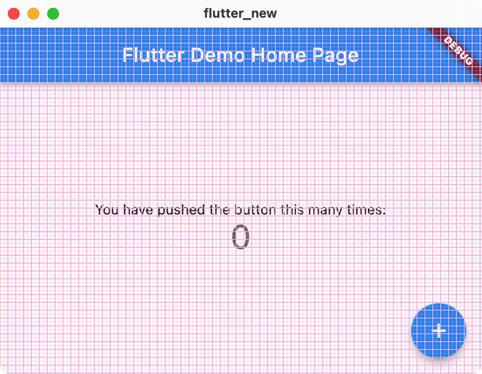
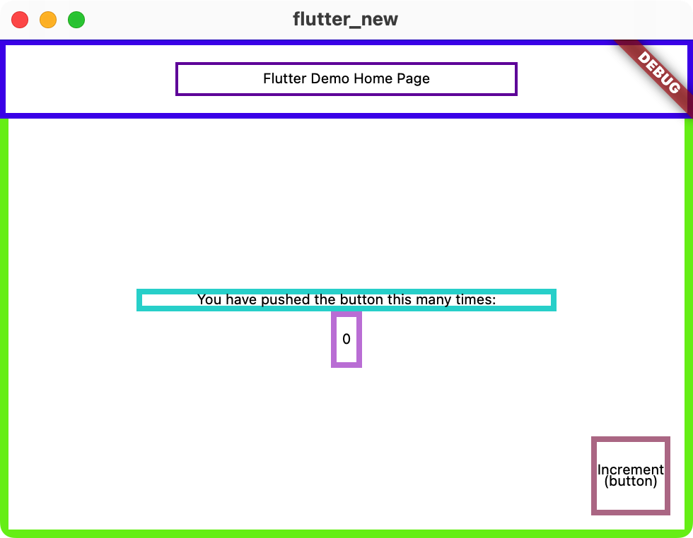
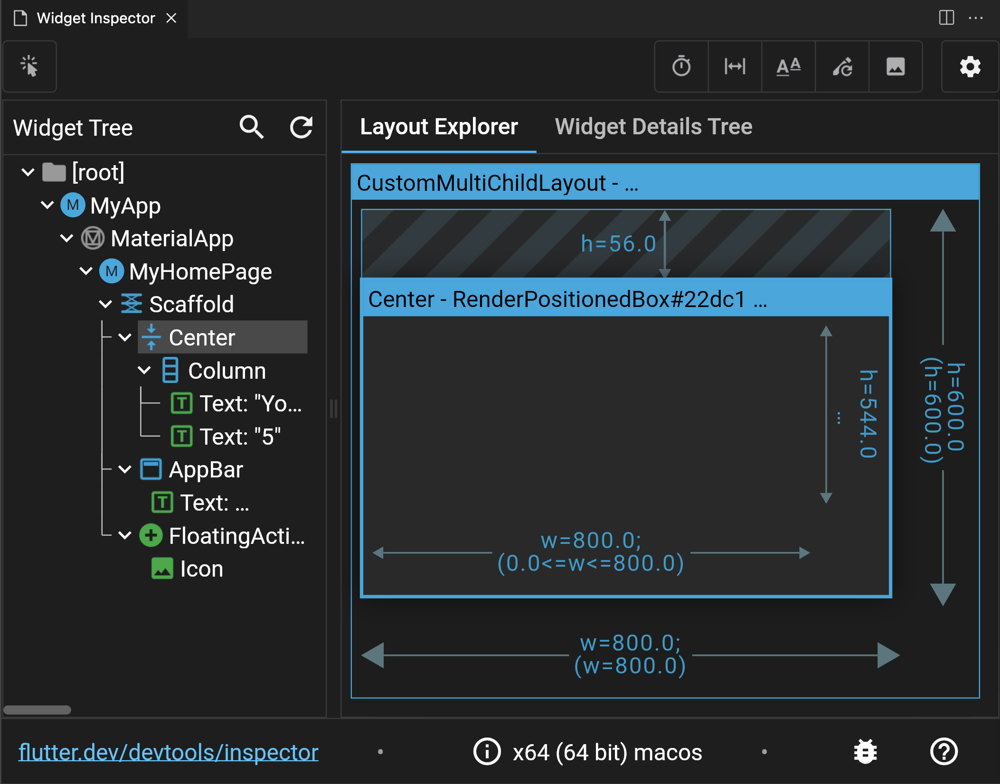
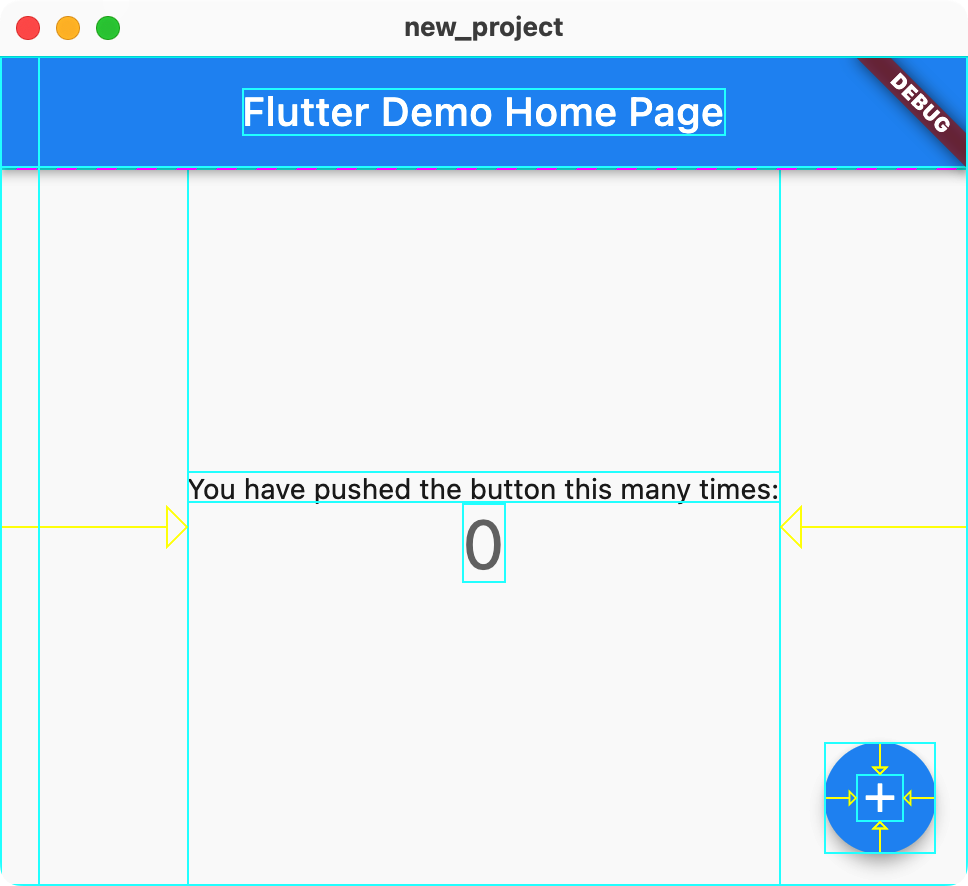

# 调试与测试

## 调试

什么是调试呢？调试是指在程序运行的过程中查看程序的状态，从而发现可能出现问题的代码。调试有很多种方法，但本质上都是在代码或者程序中插入一些开发者可以控制的行为，进一步对程序的执行进行检测和调整。

### debugPrint

最简单的调试方式就是 print 调试法了。在 Flutter 程序中，更推荐的 print 方式是 `debugPrint()`:

```dart
void Function(String?, {int? wrapWidth}) debugPrint
```

> Prints a message to the console, which you can access using the "flutter" tool's "logs" command ("flutter logs").

输入为 `String`，要想输出一个对象，使用字符串差值即可。

### MaterialApp

如果你使用了 `MaterialApp`，其中也有一些方便调试的参数：

- `debugShowCheckedModeBanner` 可以控制右上角表示调试的标志是否出现
- `debugShowMaterialGrid` 可以显示 Material Design 的网格
- `showSemanticsDebugger` 不显示 UI 而显示每个元素的外框和意义





### 断点调试

使用断点调试也是很方便的调试方法。接下来我们介绍使用 VS Code 添加断点调试 Flutter 应用的方法。

使用 `flutter create new_project` 新建一个默认的点击按钮显示的数字加一的 Flutter 工程，使用 VS Code 打开这个工程。

我们可以打开 `lib/main.dart`，在 L53 的 `_incrementCounter()` 中的 `_counter++;` 前（L60）后（L61）各添加一个断点（在行号前点击即可添加断点、再次点击可以删除）。

在 VS Code 最右下角的地方可以选择调试使用的设备：


然后使用快捷键 F5 或者在菜单栏里面点击「开始调试」（注意不是使用命令行的 `flutter run`）：


可以看到左侧的 VARIABLES 中显示出了现在应用中的变量，在 WATCH 处则可以添加自己感兴趣的监控的值（当这些值发生变化时会被高亮出来）。在左侧的 CALL STACK 可以看到全部的调用堆栈，在 BREAKPOINTS 中可以看到添加的所有断点，在程序调试的过程中你也可以对断点进行调整。

调试界面上方出现的七个按钮分别是：

- Pause (F6) Continue (F5)
- Step Over (F10)
- Step Into (F11)
- Step Out (shift F11)
- Hot Reload (ctrl F5)
- Restart (sft ctrl F5)
- Stop (sft F5)
- Open DevTools Widget Inspector Page

最后一个 Inspector 打开之后可以看待界面的布局和组件的树状结构：



感兴趣的同学可以在官网查看 [Flutter | Using the Flutter inspector](https://docs.flutter.dev/development/tools/devtools/inspector) 了解 Inspector 的更多使用方法。

### Layout 调试

想要获得一个简单的 Inspector 调试效果，也可以在代码的 `main()` 中添加 `debugPaintSizeEnabled = true;`：

> https://docs.flutter.dev/development/tools/devtools/inspector#show-guidelines

```dart
import 'package:flutter/rendering.dart' show debugPaintSizeEnabled;

void showLayoutGuidelines() {
  debugPaintSizeEnabled = true;
}
```



### 其他资源

上面所说的方式基本上足够满足普通的调试需求了，如果你希望了解更多的调试方式，可以查阅下面两篇文章：

- [Flutter | Debugging Flutter apps](https://docs.flutter.dev/testing/debugging)
- [Flutter | Debugging Flutter apps programmatically](https://docs.flutter.dev/testing/code-debugging)

## 测试

测试在软件开发的过程中起着非常重要的作用，程序员很难保证每一行代码、每一个函数、每一个功能不出问题，因此需要对每个模块进行测试。最常见的测试方式就是每次 `flutter run` 之后打开程序实际使用查看功能是否都正常。

TODO https://docs.flutter.dev/cookbook#testing 主要用实例教学 https://docs.flutter.dev/testing#continuous-integration-services

TODO https://docs.flutter.dev/testing

### 单元测试

TODO

### 界面测试

TODO

### 整体测试

TODO

## 性能

> https://docs.flutter.dev/perf
>
> - What is performance?
> - Why is performance important?
> - How do I improve performance?

关于前两个问题，详见 [Flutter | Appendix: More thoughts about performance](https://docs.flutter.dev/perf/appendix)。简单来说，「性能（performance）」是「性能测试器（performer）」根据「性能标准（metric）」得到的一系列属性；「性能」提供给开发者一个相对客观准确的评价应用某些方面的方式。

关于第三个问题，首先需要测试出现有的性能，然后再考虑提升。Flutter 应用的性能主要有 [Flutter | Performance metrics](https://docs.flutter.dev/perf/metrics) 所说的几项。简单来说有：

- 帧率（speed）
    - Flutter 相当于一个渲染框架，类似游戏引擎，达到 60 帧或者更高的帧率是一个很重要的目标。
- 内存使用（memory）
- 应用包体大小（app size）
- 应用耗电量（energy）

测试的方法主要是依托官方推出的一些性能测试工具，在 [Flutter | Performance profiling](https://docs.flutter.dev/perf/ui-performance) 中有详细的介绍。

对于提高应用性能，官网中给出了常见的一些问题和解答，以及提高应用性能的最佳实践，同时针对帧率和应用包体大小提出了具体的优化方法。这里给出官网中的相关链接，感兴趣的同学可以课下阅读：

- 常见问题 [Flutter | Performance FAQ](https://docs.flutter.dev/perf/faq)
- 最佳实践 [Flutter | Performance best practices](https://docs.flutter.dev/perf/best-practices)
- 优化帧率 [Flutter | Improving rendering performance](https://docs.flutter.dev/perf/rendering-performance)
- 优化包体大小 [Flutter | Measuring your app's size](https://docs.flutter.dev/perf/app-size)
