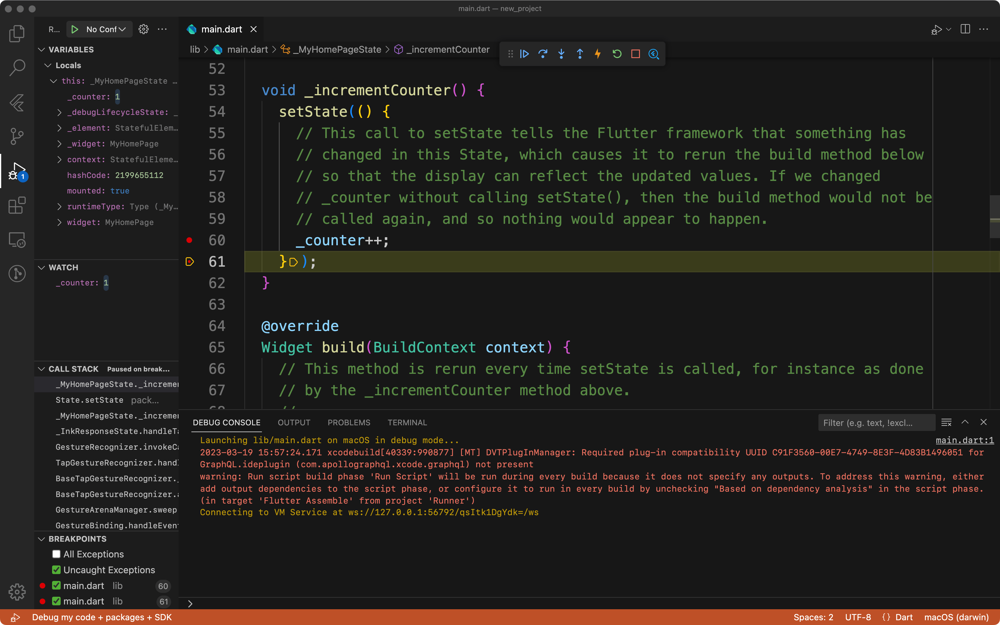
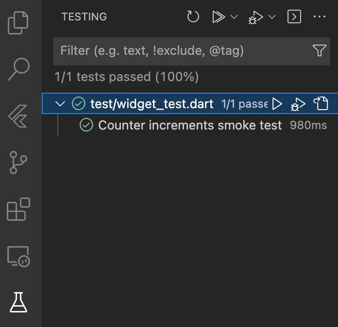
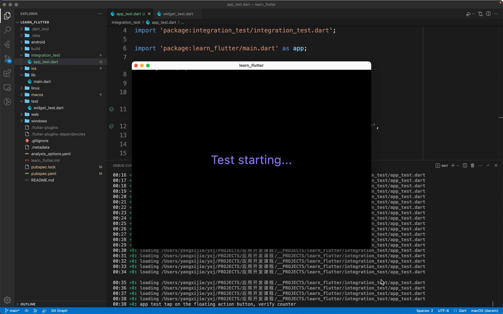
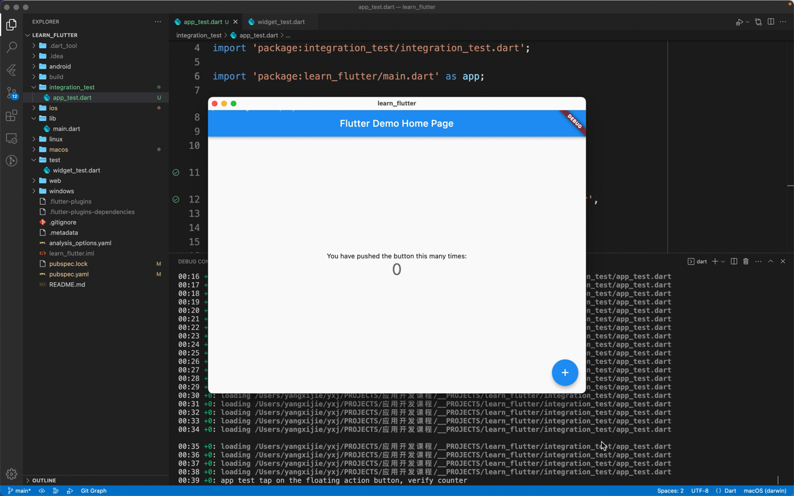

# 调试与测试

## 调试

什么是调试呢？调试是指在程序运行的过程中查看程序的状态，从而发现可能出现问题的代码。调试有很多种方法，但本质上都是在代码或者程序中插入一些开发者可以控制的行为，进一步对程序的执行进行检测和调整。

### debugPrint

最简单的调试方式就是 print 调试法了。在 Flutter 程序中，更推荐的 print 方式是 `debugPrint()`:

```dart
void Function(String?, {int? wrapWidth}) debugPrint
```

> Prints a message to the console, which you can access using the "flutter" tool's "logs" command ("flutter logs").

输入为 `String`，要想输出一个对象，使用字符串差值即可。

### MaterialApp

如果你使用了 `MaterialApp`，其中也有一些方便调试的参数：

- `debugShowCheckedModeBanner` 可以控制右上角表示调试的标志是否出现
- `debugShowMaterialGrid` 可以显示 Material Design 的网格
- `showSemanticsDebugger` 不显示 UI 而显示每个元素的外框和意义


### 断点调试

使用断点调试也是很方便的调试方法。接下来我们介绍使用 VS Code 添加断点调试 Flutter 应用的方法。

使用 `flutter create new_project` 新建一个默认的点击按钮显示的数字加一的 Flutter 工程，使用 VS Code 打开这个工程。

我们可以打开 `lib/main.dart`，在 L53 的 `_incrementCounter()` 中的 `_counter++;` 前（L60）后（L61）各添加一个断点（在行号前点击即可添加断点、再次点击可以删除）。

在 VS Code 最右下角的地方可以选择调试使用的设备：


然后使用快捷键 F5 或者在菜单栏里面点击「开始调试」（注意不是使用命令行的 `flutter run`）：



可以看到左侧的 VARIABLES 中显示出了现在应用中的变量，在 WATCH 处则可以添加自己感兴趣的监控的值（当这些值发生变化时会被高亮出来）。在左侧的 CALL STACK 可以看到全部的调用堆栈，在 BREAKPOINTS 中可以看到添加的所有断点，在程序调试的过程中你也可以对断点进行调整。

调试界面上方出现的七个按钮分别是：

- Pause (F6) Continue (F5)
- Step Over (F10)
- Step Into (F11)
- Step Out (shift F11)
- Hot Reload (ctrl F5)
- Restart (sft ctrl F5)
- Stop (sft F5)
- Open DevTools Widget Inspector Page

最后一个 Inspector 打开之后可以看待界面的布局和组件的树状结构：


感兴趣的同学可以在官网查看 [Flutter | Using the Flutter inspector](https://docs.flutter.dev/development/tools/devtools/inspector) 了解 Inspector 的更多使用方法。

### Layout 调试

想要获得一个简单的 Inspector 调试效果，也可以在代码的 `main()` 中添加 `debugPaintSizeEnabled = true;`：

> https://docs.flutter.dev/development/tools/devtools/inspector#show-guidelines

```dart
import 'package:flutter/rendering.dart' show debugPaintSizeEnabled;

void showLayoutGuidelines() {
  debugPaintSizeEnabled = true;
}
```


### 其他资源

上面所说的方式基本上足够满足普通的调试需求了，如果你希望了解更多的调试方式，可以查阅下面两篇文章：

- [Flutter | Debugging Flutter apps](https://docs.flutter.dev/testing/debugging)
- [Flutter | Debugging Flutter apps programmatically](https://docs.flutter.dev/testing/code-debugging)

## 测试

测试在软件开发的过程中起着非常重要的作用，程序员很难保证每一行代码、每一个函数、每一个功能不出问题，因此需要对每个模块进行测试；在发布前为了确保应用不出现闪退或功能异常的情况，对应用整体也会进行测试。最常见的测试方式就是每次 `flutter run` 之后打开程序实际使用查看功能是否都正常。但是当你的应用越来越大，手动去做测试也是越来越难。

Dart 和 Flutter 也支持了很多与代码集成的自动化测试的方式，自动化的测试能够在确保新功能添加和修复 bug 的速度的基础上帮助你在发布应用前确保应用执行正确。

Dart / Flutter 聚焦于以下的三种测试：

- 单元测试（unit tests）：测试程序的最小部分（如一个函数、方法或类）。
- 组件测试（component / Widget tests）：测试一个组件（一般由多个类组成）是否正常工作 / 测试一个 Widget 的界面和交互正常。
- 整体和端到端测试（integration / end-to-end / GUI tests）：测试应用整体或者大部分的表现（如性能），这类测试往往会运行在虚拟机或实际的物理设备上。

Dart 测试主要参考内容：

> - [Dart | Dart testing](https://dart.dev/guides/testing)
> - [pub.dev | package:test](https://pub.dev/packages/test)

我们一般会使用 [package:test](https://pub.dev/packages/test) 向代码中添加测试的部分，然后用 `dart test` 这个命令启动测试。你可以查看这个包的 README 来了解简单的测试方式。由于这部分并不是课程重点，且在后面的 Flutter 测试部分我们讲的内容和 Dart 的测试高度重叠，所以这里不做讲解。

Flutter 测试主要参考内容：

> - [Flutter | Testing Flutter apps](https://docs.flutter.dev/testing)
> - [Flutter Cookbook | Testing](https://docs.flutter.dev/cookbook#testing)
> - [Flutter API | flutter_test](https://api.flutter.dev/flutter/flutter_test/flutter_test-library.html)
> - [Flutter API | flutter_driver](https://api.flutter.dev/flutter/flutter_driver/flutter_driver-library.html)
> - [Codelabs | How to test a Flutter app](https://codelabs.developers.google.com/codelabs/flutter-app-testing)

<!-- 你也可以在命令行使用 `flutter test --help` 来查看关于 Flutter 测试的相关帮助。（感觉这一个命令的输出完全没有用，先注释掉了。） -->

下面我们会结合一些案例来讲解如何对一个 Flutter 工程进行测试——

> 如果你希望一个更加完整的案例，也可以查看 [Codelabs | How to test a Flutter app](https://codelabs.developers.google.com/codelabs/flutter-app-testing#0)。

### 单元测试

使用 `flutter create learn_flutter` 创建一个名为 learn_flutter 的项目，使用编辑器打开。

在 `pubspec.yaml` 的 `dev_dependencies` 中添加 `test`：

```yml
dev_dependencies:
  ...
  test:
```

创建如下两个文件：

**lib/counter.dart**:

```dart
class Counter {
  int value = 0;
  void increment() => value++;
  void decrement() => value--;
}
```

**test/counter_test.dart**:

```dart
import 'package:learn_flutter/counter.dart';
import 'package:test/test.dart';

void main() {
  test('Counter value should be incremented', () {
    final counter = Counter();
    counter.increment();
    expect(counter.value, 1);
  });
}
```

在 test 文件夹下，我们可以根据测试的目的新建很多个测试文件。这里我们新建 counter_test.dart，里面调用 `test()` 这个函数，第一个 `dynamic description` 参数传入测试的内容，第二个 `dynamic Function() body` 参数传入要测试的函数。这样我们就写好了一个测试样例。当进行测试时，这个文件中的 `main()` 会作为一个 Dart 程序被执行，从而得到测试结果。

在命令行执行 `flutter test test/counter_test.dart`:

```
$ flutter test test/counter_test.dart
00:00 +0: loading /xxx/learn_flutter/test/counter_test.dart
00:01 +0: loading /xxx/learn_flutter/test/counter_test.dart
00:02 +0: loading /xxx/learn_flutter/test/counter_test.dart
00:02 +1: All tests passed!
```

看到 **All tests passed!** 说明 test/counter_test.dart 这个文件对应的测试都已经通过。

我们可以修改 lib/counter.dart 中的 `increment()` 使每次调用 `counter += 2;`；或者修改 test/counter_test.dart，重复 `counter.increment();` 这行代码（加两次）。之后再次执行 `flutter test test/counter_test.dart`，会得到类似下面呈现的报错：

```
$ flutter test test/counter_test.dart
00:00 +0: loading /xxx/learn_flutter/test/counter_test.dart
00:01 +0: loading /xxx/learn_flutter/test/counter_test.dart
00:02 +0: loading /xxx/learn_flutter/test/counter_test.dart
00:02 +0 -1: Counter value should be incremented 
[E]
  Expected: <1>
    Actual: <2>

  package:test_api            expect
  test/counter_test.dart 9:5  main.<fn>


To run this test again: /path/to/dart test /xxx/learn_flutter/test/counter_test.dart -p vm --plain-name 'Counter value should be incremented'
00:02 +0 -1: Some tests failed.
```

看到 **Some tests failed.** 说明有一些测试样例未通过。这时我们就要查看代码是不是哪里出现了问题（当然也有可能是测试样例有问题）我们需要对应进行修改。

#### 使用 group 将多个测试样例成组

与 `test()` 类似，`group()` 的前两个参数是 `dynamic description` 和 `dynamic Function() body`。

```dart
import 'package:learn_flutter/counter.dart';
import 'package:test/test.dart';

void main() {
  group('Counter', () {
    test('value should start at 0', () {
      expect(Counter().value, 0);
    });

    test('value should be incremented', () {
      final counter = Counter();
      counter.increment();
      expect(counter.value, 1);
    });

    test('value should be decremented', () {
      final counter = Counter();
      counter.decrement();
      expect(counter.value, -1);
    });
  });
}
```

```
$ flutter test test/counter_test.dart
00:00 +0: loading /xxx/learn_flutter/test/counter_test.dart                                          00:01 +0: loading /xxx/learn_flutter/test/counter_test.dart                                          00:02 +0: loading /xxx/learn_flutter/test/counter_test.dart                                          00:02 +3: All tests passed!
```

#### TODO https://pub.dev/packages/test

TODO

### 组件测试

我们也是使用 `flutter create learn_flutter` 来创建一个点击按钮加加的 Flutter 默认模板应用。不做任何修改：

可以看到 `pubspec.yaml` 的 `dev_dependencies` 中添加了 `flutter_test`；与 `test` 相比，`flutter_test` 添加了对 Widget 的测试：

```yml
dev_dependencies:
  ...
  flutter_test:
    sdk: flutter
```

可以看到 `test/widget_test.dart` 中已经有了一些代码，在 `main()` 中调用 `testWidgets()`，其前两个参数为 `String description` 和 `Future<void> Function(WidgetTester) callback`，通过 `callback` 的参数拿到 `tester WidgetTester`，在函数体中就可以使用 `tester` 来进行测试了：

```dart
// Build our app and trigger a frame.
await tester.pumpWidget(const MyApp());

// Verify that our counter starts at 0.
expect(find.text('0'), findsOneWidget);
expect(find.text('1'), findsNothing);

// Tap the '+' icon and trigger a frame.
await tester.tap(find.byIcon(Icons.add));
await tester.pump();

// Verify that our counter has incremented.
expect(find.text('0'), findsNothing);
expect(find.text('1'), findsOneWidget);
```

`pumpWidget()` 会构建传入的 Widget 并且（在测试环境）渲染出这个 Widget。之后我们主要使用 `find()` 来确定渲染得到的界面是否符合我们的预期，比如最开始应该只有一个呈现 0 的 Widget。

接下来我们调用 `tester.tap()`，模拟点击界面中的 FAB，再调用 `tester.pump()` 渲染一帧。这时，界面中应该有一个呈现 1 的 Widget。

我们可以在命令行使用 `flutter test test/widget_test.dart` 进行测试，看到 `All tests passed!` 说明测试成功。

我们也可以点击 VS Code 代码左侧的播放键来进行测试：


点击之后可以在下方的 Debug Console 处看到输出的信息：


在左侧的 TESTING panel 可以看到不同的测试样例的测试结果：



以上呈现的就是一个最简单的 Widget 测试。

关于更多 Widget 测试的示例，可以查阅：

- [Cookbook Testing Widget | Find widgets](https://docs.flutter.dev/cookbook/testing/widget/finders)
- [Cookbook Testing Widget | Handle scrolling](https://docs.flutter.dev/cookbook/testing/widget/scrolling)
- [Cookbook Testing Widget | Tap, drag, and enter text](https://docs.flutter.dev/cookbook/testing/widget/tap-drag)

### 整体测试

首先我们需要在 `pubspec.yaml` 的 `dev_dependencies` 中添加 `flutter_test` 和 `integration_test`：

```yml
dev_dependencies:
  flutter_test:
    sdk: flutter
  integration_test:
    sdk: flutter
```

接下来我们来编辑整体测试的文件。在项目的根目录新建文件夹 `integration_test/`（名称不可更改），在其中新建文件 `app_test.dart`（名称可更改），其中写入：

```dart
import 'package:flutter/material.dart';

import 'package:flutter_test/flutter_test.dart';
import 'package:integration_test/integration_test.dart';

import 'package:learn_flutter/main.dart' as app;

void main() {
  IntegrationTestWidgetsFlutterBinding.ensureInitialized();

  group('app test', () {
    testWidgets('tap on the floating action button, verify counter',
        (tester) async {
      app.main();
      await tester.pumpAndSettle();

      // Verify the counter starts at 0.
      expect(find.text('0'), findsOneWidget);
      expect(find.text('1'), findsNothing);

      // Tap the '+' icon and trigger a frame.
      await tester.tap(find.byIcon(Icons.add));
      await tester.pumpAndSettle();

      // Verify that our counter has incremented.
      expect(find.text('0'), findsNothing);
      expect(find.text('1'), findsOneWidget);
    });
  });
}
```

- 可以看到整体测试和 Widget 测试最大的区别是，调用了 `IntegrationTestWidgetsFlutterBinding.ensureInitialized()`。这个函数会初始化一些参数，使得之后的测试在目标机平台进行。
- 这里更新一帧主要使用 `tester.pumpAndSettle()`，它会持续调用 `tester.pump()` 知道没有新的帧要刷新，这会等待所有动画完成。
- 其他内容基本上与 Widget 测试一致。

在命令行，使用 `flutter test integration_test/app_test.dart` 即可执行整体测试：

```
$ flutter test integration_test/app_test.dart       
Multiple devices found:
macOS (desktop) • macos  • darwin-x64     • macOS 12.6.3 21G419 darwin-x64
Chrome (web)    • chrome • web-javascript • Google Chrome 111.0.5563.110
[1]: macOS (macos)
[2]: Chrome (chrome)
Please choose one (To quit, press "q/Q"): 2
Web devices are not supported for integration tests yet.
```

这里会提示选择一个设备，选择 Chrome 会提示 web 现在不支持整体测试。使用 ChromeDrive 看起来可以进行测试，感兴趣的同学可以参考 [flutter/packages/integration_test](https://github.com/flutter/flutter/tree/main/packages/integration_test) 进行尝试。

这里我们使用 `flutter test integration_test/app_test.dart -d mac` 选择本机的其他平台进行测试。可以看到应用自动被构建，开启，执行测试，被关闭的过程。整个过程结束，测试结束。





以上所说的整体测试并没有对性能进行测试，对这方面感兴趣的同学可以课后查看 [Cookbook Testing Integration | Performance profiling](https://docs.flutter.dev/cookbook/testing/integration/profiling)。

## 性能

> https://docs.flutter.dev/perf
>
> - What is performance?（什么是性能？）
> - Why is performance important?（为什么性能很重要？）
> - How do I improve performance?（我如何提升性能？）

关于前两个问题，详见 [Flutter | Appendix: More thoughts about performance](https://docs.flutter.dev/perf/appendix)。简单来说，「性能（performance）」是「性能测试器（performer）」根据「性能标准（metric）」得到的一系列属性；「性能」提供给开发者一个相对客观准确的评价应用某些方面的方式。

关于第三个问题，首先需要测试出现有的性能，然后再考虑提升。Flutter 应用的性能主要有 [Flutter | Performance metrics](https://docs.flutter.dev/perf/metrics) 所说的几项。简单来说有：

- 帧率（speed）
    - Flutter 相当于一个渲染框架，类似游戏引擎，达到 60 帧或者更高的帧率是一个很重要的目标。
- 内存使用（memory）
- 应用包体大小（app size）
- 应用耗电量（energy）

测试的方法主要是依托官方推出的一些性能测试工具，在 [Flutter | Performance profiling](https://docs.flutter.dev/perf/ui-performance) 中有详细的介绍。

对于提高应用性能，官网中给出了常见的一些问题和解答，以及提高应用性能的最佳实践，同时针对帧率和应用包体大小提出了具体的优化方法。这里给出官网中的相关链接，感兴趣的同学可以课下阅读：

- 常见问题 [Flutter | Performance FAQ](https://docs.flutter.dev/perf/faq)
- 最佳实践 [Flutter | Performance best practices](https://docs.flutter.dev/perf/best-practices)
- 优化帧率 [Flutter | Improving rendering performance](https://docs.flutter.dev/perf/rendering-performance)
- 优化包体大小 [Flutter | Measuring your app's size](https://docs.flutter.dev/perf/app-size)

在实际的项目中，优化程序的性能可能并不会是从一开始就需要考虑的东西。你可以先开发一版应用程序，开发之后再进行整体测试，如果性能达不到项目要求，这时可以考虑再去优化。当然在实际的场景中，你可能还需要在多台不同的设备上进行测试，确保一些持有相对较早的机型的用户也能够有很好的体验。
