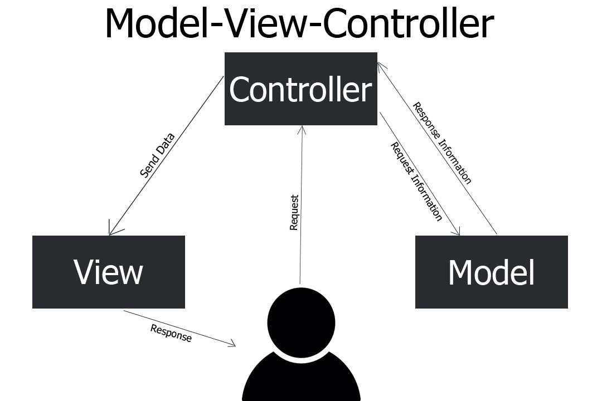
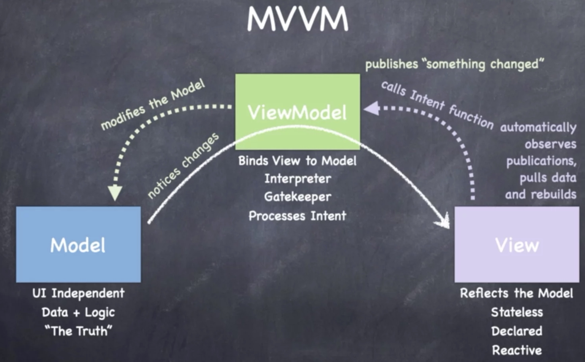

# 关于升级课程的一些考虑 221120

> 王继良老师最初和杨希杰聊想要升级课程的时候杨希杰总结的一份文档

老师好。我看了咱们全部的课件，也看了[咱们的作业](https://thssandroid.github.io)，还有[老师自己对课程设计的思考](https://thssandroid.github.io/课程回顾及感想/)。我有一些想法，但是比较零碎，先写下来，咱们之后再详细讨论。

## 移动应用开发框架的种类

**比较老的方式是 imperative，也就是命令式。** 比如要更改一个Label的值，你需要用 `myLabel.text = "new text"` 这样的方式。

命令式常用的数据交互组织方式是：[MVC](https://en.wikipedia.org/wiki/Model–view–controller)（model view controller），model（数据）和view（用户界面）之间通过 controller 交互。遇到的问题主要是一些很简单的操作为了符合MVC也要经过controller，而且所有的操作都写到 controller controller 越写越大。

> ps. 我强烈不推荐用xml文件写UI然后添加约束的方式（如 Storyboard）…要用命令式的话最好都用代码生成UI。

**比较新的方式是 declarative，也就是声明式。** 比如你要改变一个Label的值，首先要有一个变量，比如 `labelText`，然后在Label中使用这个值 `myLabel = Label(text: $labelText)`，这里 `$` 相当于把 `myLabel.text` 和 `labelText` 这个变量绑定起来了，要修改 `myLabel` 的值，只需要修改 `labelText` 这个变量，UI框架就会自动将用户界面进行更新。

声明式常用的数据组织架构是MVVM（model view viewmodel）。在声明式框架中，只要数据变了，UI就会更新（框架提供）。所以数据源只有Model。ViewModel可以理解为只是为了方便访问model的一个函数库（处理用户的intents）。

（图来自 https://cs193p.sites.stanford.edu Lecture 3）

**老师提到要更新课程**， 比如「是不是还要基于安卓、是不是要基于ios、是不是要基于java、一些开放的生态呢，例如react flutter」，我感觉 **这些不本质，本质的应该是这两种框架的选取。**

老师课上所讲的应该是命令式，除了传统安卓开发，传统iOS开发（AppKit/UIKit + Objective-C/Swift + Storyboard）和Qt也是这种方式。从我的认知来说，现在声明式应该是非常流行的，网页端的 React / Vue 都是声明式，紧接着苹果推出了 [SwiftUI](https://developer.apple.com/xcode/swiftui/)+Swift，Google采用了[Jetpack Compose 框架](https://developer.android.com/jetpack/compose)+Kotlin 作为官方推荐的应用构建方式，[Flutter](https://flutter.dev) 也是这个思路。声明式的优点包括但不限于 所需要的代码量减少、UI代码逻辑清晰、数据组织相对容易、hot-reload加速开发……**要说移动应用开发的趋势，我觉得一定是声明式。**

**如果老师希望升级课程，我推荐使用一个声明式的框架——可以是 [Compose](https://developer.android.com/jetpack/compose)+Kotlin，可以是 [Flutter](https://flutter.dev)+Dart。**

但是有一点需要注意的是，用了这样的框架，底层系统相关的知识就被屏蔽掉了。做一款移动应用，我想没有人会去关注底层操作系统到底是怎么处理中断、传递消息的。基本上都是 **UI框架代码编写+API调用** 就可以完成一款应用的快速交付。这和「科学精神和计算机系统思维：将移动开发与现有计算机系统其他技术结合起来介绍，希望能够触类旁通，例如跟操作系统、计算机网络、嵌入式系统、数据库系统、图形图像等」是相差甚远的。当然，我们可以更关注框架本身使用的技术，比如框架中的动画效果如何实现、框架如何进行view的资源管理……这些东西也符合计算机相关的底层知识。由此，我想再说说**移动应用开发课程的种类**：

## 移动应用开发课程的种类

我觉得移动应用开发课程应该分成两种，这两种课程的侧重点完全不同：

- 一种，目标在于让同学理解应用开发原理，以硬核的计算机操作系统知识、计算机图形学技术为基础，教给学生实时 2D UI 绘制、UI 资源管理、用户手势处理等专题，使得同学们能够了解现代UI框架的发展，**自己创建一个应用开发的框架**。这种课就比较硬核了，有专业课的感觉。【应用开发框架原理】
- 另一种，是以**同学们创造自己的移动应用**为核心，为了达成同学们自己实现创意的app，课程教给同学们设计app的框架、美术设计、构建UI的方式、UI与数据交互等专题，在课程最后以展示的方式大家呈现自己做的app。这种方式基本上就是课赛结合了。【移动应用创意开发】

我觉得两种方式都很好，根据课时和安排可以选择其中的一种或两种进行讲授。

### 【应用开发框架原理】

以一款开源的框架为基础进行讲授是最好的，比如基于开源的 Flutter 框架 和 Skia 2D 渲染库，讲授如何组织应用开发的资源才能达成实时渲染，且为开发者提供良好的开发体验。这样设计课程的话，就有点像 [Games104-现代游戏引擎：从入门到实践](https://www.bilibili.com/video/BV1oU4y1R7Km/) 了。

可以先讲授一个UI框架如何使用，然后深入这个UI框架的源码，做对应的原理讲解。

可以有一两周讲讲各种UI框架的技术、讲一讲OpenGL、讲一讲GPU图形流水线。

### 【移动应用创意开发】

课赛结合的话，主要就是讲授使用的UI框架和组织同学们小组合作了。感觉如果非信息学院的同学比较多，这种方式也更合适一些。

#### 理论讲授

- 绪论
- UI框架使用的语言
- UI框架基础
- UI专题（如Layout/Gesture/Navigation/Animation）
- 数据组织专题（各种持久化方式）
- 操作系统特性（如Audio/Video/Bluetooth）
- 设备平台特性
- 测试、打包、发布

#### 课程设计

- 头脑风暴选题（限制在Android工具类/生产力/社交app会比较好），较早形成小组
- 需要有一周来讲设计，包括如何去组织一款应用（前端UI后端数据），如何进行UI设计（提及一款UI设计软件，如Figma）
- 小组提交设计方案和UI稿
- 课程组提供相应的技术支持（如答疑等）
- 小组答辩和现场展示

### 二者结合

两者结合也是很好的思路，想偏应用层就搞比赛，想偏底层就讲框架原理……

## 其他一些考虑

* 原生开发是有优势的，直接调用底层的API是最好的，但是开发效率可能并没有那么高
* Java不Java我觉得不本质，得看选什么框架，对应选择什么语言
* 如果目标是教移动应用开发，那么选一个框架还可以选两个框架、三个框架。
